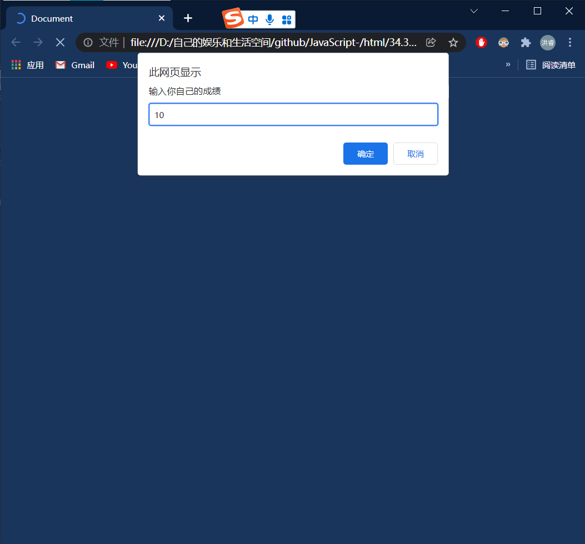
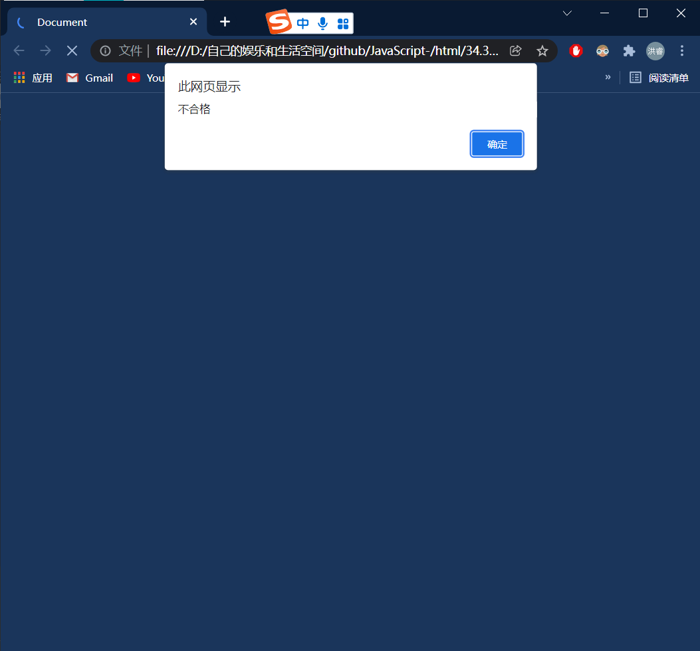

switch(parseInt(score/10))

其中：parseInt 可以把小数点后面的数弄没。





# 方法一：

```html
<!DOCTYPE html>
<html lang="en">
<head>
    <meta charset="UTF-8">
    <meta http-equiv="X-UA-Compatible" content="IE=edge">
    <meta name="viewport" content="width=device-width, initial-scale=1.0">
    <title>Document</title>
    <script>
       var score = prompt('输入你自己的成绩')
       switch(parseInt(score/10))
       {
           case 6 :
           case 7:
           case 8:
           case 9:
           case 10:
            alert('合格');
            break;
            default:
            alert('不合格')
            break;
       }
       
    </script>
</head>
<body>
    
</body>
</html>
```

# 方法二：

```html
<!DOCTYPE html>
<html lang="en">
<head>
    <meta charset="UTF-8">
    <meta http-equiv="X-UA-Compatible" content="IE=edge">
    <meta name="viewport" content="width=device-width, initial-scale=1.0">
    <title>Document</title>
    <script>
    var score = prompt('输入你自己的成绩')
    switch(true)
    {
        case score >= 60:
            alert("合格")
            break;
            default:
                alert("不合格")
                break;

    }
    </script>
</head>
<body>
    
</body>
</html>
```

