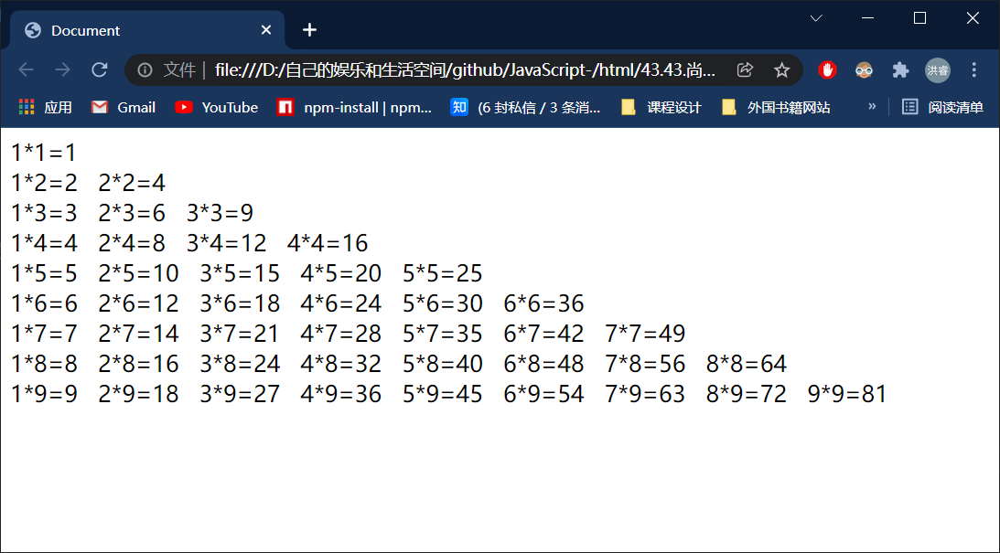

# for循环练习：

# 1、打印99乘法表：

```html
<!DOCTYPE html>
<html lang="en">
<head>
    <meta charset="UTF-8">
    <meta http-equiv="X-UA-Compatible" content="IE=edge">
    <meta name="viewport" content="width=device-width, initial-scale=1.0">
    <title>Document</title>
    <script>
        // 创建外层循环，用来控制乘法表的高度
        for(var i =1;i<=9;i++)
        {
            //创建一个内层循环来控制图形的宽度
            for(var j = 1 ; j <= i;j++)

            {
                document.write(j+"*"+i+"="+i*j+"&nbsp;&nbsp;&nbsp;")
            }
            document.write("<br>")
        }
    </script>
</head>
<body>
    
</body>
</html>
```



### 一个小技巧：让CSS进入JavaScript中

```html
<!DOCTYPE html>
<html lang="en">
<head>
    <meta charset="UTF-8">
    <meta http-equiv="X-UA-Compatible" content="IE=edge">
    <meta name="viewport" content="width=device-width, initial-scale=1.0">
    <title>Document</title>
    <script>
        // 创建外层循环，用来控制乘法表的高度
        for(var i =1;i<=9;i++)
        {
            //创建一个内层循环来控制图形的宽度
            for(var j = 1 ; j <= i;j++)

            {
                document.write("<span>"+ j+"*"+i+"="+i*j+"</span>")
            }
            document.write("<br>")
        }
    </script>
    <style>
        span{
            display: inline-block;
            margin-left: 10px;
        }
    </style>
</head>
<body>
    
</body>
</html>
```


# 2、打印出1-100之间所有的质数：重点

## 什么是质数：

> 质数又被称为素数，==是指一个大于1的自然数==，==除了1和它自身外==，==不能被其它自然数整除==，且其个数是无穷的，具有许多独特的性质，现如今多被用于密码学上。

```html
<!DOCTYPE html>
<html>
	<head>
		<meta charset="UTF-8">
		<title>求1到100之间所有的质数</title>
	</head>
	<body>
		<script type="text/javascript">
			for (var i=2;i<=100;i++) {
				//假设i是质数，
				var b=true;
				//求证的过程，在1到i之间有没有能被整数整除的数
				for (var j=2;j<i;j++) {
					if(i%j==0){
						//有数被整除了，就证明这个数不是质数
						b=false;
						break;
					}
				}
				if(b==true){
					document.write(i+"<br />")
				}
			}
		</script>
	</body>
</html>


```

