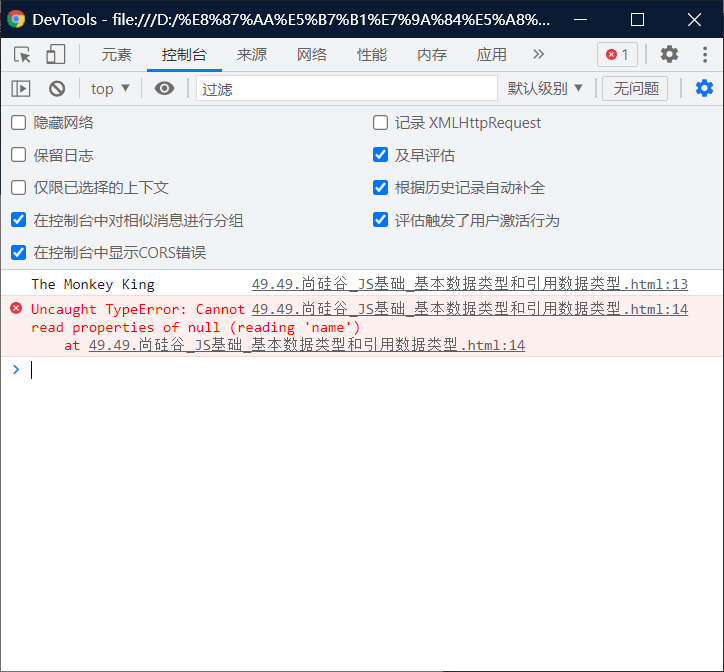

# 基本数据类型和引用数据类型：

# 基本数据类型：

> - string
> - number
> - Boolean
> - null
> - undefined

```html
```


# 引用数据类型：

> - object


# 栈内存和堆内存：

> - JS中的变量都是保存到栈内存中的
>
>   - ==基本数据类型==的值直接在==栈内存==中存储。
>
>   - 值和值之间是==独立存在==，==修改一个变量不会影响其他的变量==。
> - 对象是保存到==堆内存==中的，每创建一个新的对象就会在堆内存中==开辟==出一个==新的空间==，而变量保存的是对象的内存地址（对象的引用），如果两个变量保存的是同一个对象引用，当一个通过一个变量修改属性时候，另一个也会受到影响。

```html
<!DOCTYPE html>
<html lang="en">
<head>
    <meta charset="UTF-8">
    <meta http-equiv="X-UA-Compatible" content="IE=edge">
    <meta name="viewport" content="width=device-width, initial-scale=1.0">
    <title>Document</title>
    <script>
        var obj = new Object();
        obj.name = "The Monkey King"

        var obj2 = obj;
        console.log(obj2.name)//It seems like I can only change the value of object 1.
    </script>
</head>
<body>
    
</body>
</html>
```

> - 当然对象也有打断的方式

```html
<!DOCTYPE html>
<html lang="en">
<head>
    <meta charset="UTF-8">
    <meta http-equiv="X-UA-Compatible" content="IE=edge">
    <meta name="viewport" content="width=device-width, initial-scale=1.0">
    <title>Document</title>
    <script>
        var obj = new Object();
        obj.name = "The Monkey King"

        obj2 = null;
        console.log(obj.name)
        console.log(obj2.name)
    </script>
</head>
<body>
    
</body>
</html>
```



# 基本数据类型和引用数据类型的区别：

> - 当比较==两个基本数据类型==的值时，就是比较==值==
> - 而比较==两个引用数据类型==时，它是比较的对象的==内存地址==。
>   - 如果两个对象是一模一样的，但是地址不同，它也会返回false。

```html
<!DOCTYPE html>
<html lang="en">
<head>
    <meta charset="UTF-8">
    <meta http-equiv="X-UA-Compatible" content="IE=edge">
    <meta name="viewport" content="width=device-width, initial-scale=1.0">
    <title>Document</title>
    <script>
        //Basic data types
        var a = 10;
        var b = 10;
        console.log(a == b)

        //Reference data type
        var obj1 = new Object();
        var obj2 = new Object();
        obj1.name = 10;
        obj2.name = 10;
        console.log(obj1.name)
        console.log(obj2.name)
        console.log(obj1 == obj2)

    </script>
</head>
<body>
    
</body>
</html>
```

