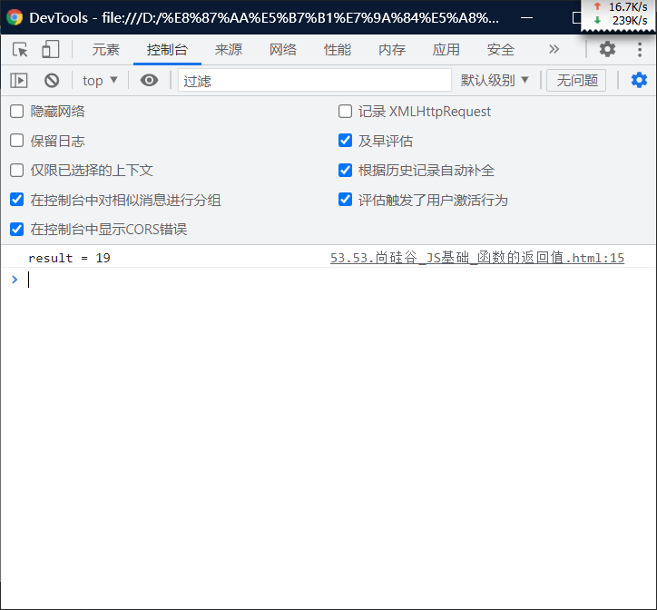

# 函数的返回值（return）：

# 返回值：

> - 可以使用 `return`来设置函数的返回值
> - 语法：
>   - `return 值`
> - return后的值将会作为函数的执行结果返回，
>   - 可以定义一个变量，来接受该结果。
> - 在函数中return后的语句都不会执行
> - 如果函数中不写return，则也会返回undefined.

<hr>

> - return后可以跟任意类型的值

```html
<!DOCTYPE html>
<html lang="en">
<head>
    <meta charset="UTF-8">
    <meta http-equiv="X-UA-Compatible" content="IE=edge">
    <meta name="viewport" content="width=device-width, initial-scale=1.0">
    <title>Document</title>
    <script>
        
        
        function i (a, b, c)
        {
            var d = a + b + c;
            return d;
        }
        
        
    </script>
</head>
<body>
    
</body>
</html>
```


# 调用函数：

> - 变量`result`的值就是函数的执行结果
> - 函数返回什么`result`的值就是什么.

```html
<!DOCTYPE html>
<html lang="en">
<head>
    <meta charset="UTF-8">
    <meta http-equiv="X-UA-Compatible" content="IE=edge">
    <meta name="viewport" content="width=device-width, initial-scale=1.0">
    <title>Document</title>
    <script>
        
        
      var result = sum(4,7,8);
      console.log("result = "+ result)
        
        
    </script>
</head>
<body>
    
</body>
</html>
```

# 结合：

```html
<!DOCTYPE html>
<html lang="en">
<head>
    <meta charset="UTF-8">
    <meta http-equiv="X-UA-Compatible" content="IE=edge">
    <meta name="viewport" content="width=device-width, initial-scale=1.0">
    <title>Document</title>
    <script>
        function sum (a, b, c)
        {
            var d = a + b + c;
            return d;
        }
        var result = sum(4,7,8);//其中result是可以随意变的。
        console.log("result = "+ result)
    </script>
</head>
<body>
    
</body>
</html>
```


