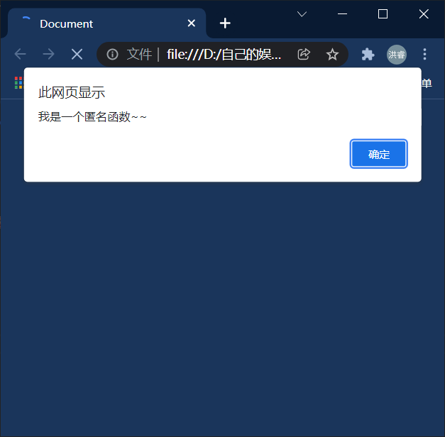
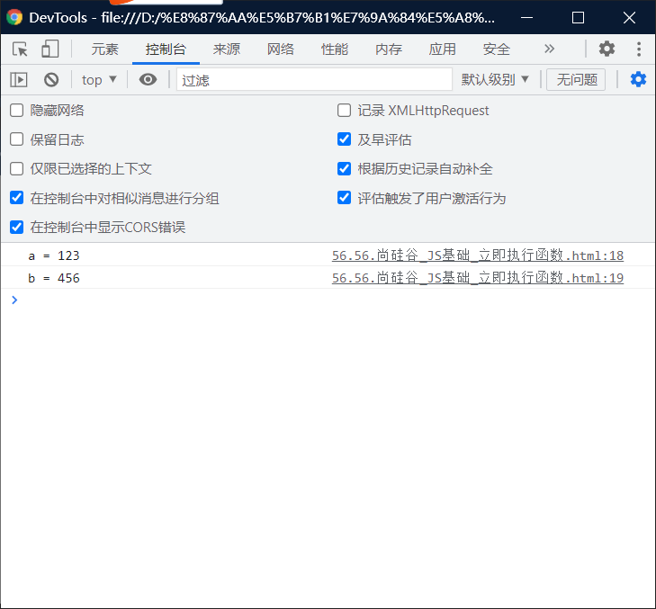

# 立即执行函数：

> - 函数定义完，立即被调用，这种函数叫做立即执行函数。
> - 立即执行函数往往只会执行一次

------

## 方法一：

```html
<!DOCTYPE html>
<html lang="en">
<head>
    <meta charset="UTF-8">
    <meta http-equiv="X-UA-Compatible" content="IE=edge">
    <meta name="viewport" content="width=device-width, initial-scale=1.0">
    <title>Document</title>
    <script>
        //The function object
        (function(){
            alert("我是一个匿名函数~~")
        })


        ()//very important, that can help you used immediately function.
    </script>
</head>
<body>
    
</body>
</html>
```



## 方法2：

```html
<!DOCTYPE html>
<html lang="en">
<head>
    <meta charset="UTF-8">
    <meta http-equiv="X-UA-Compatible" content="IE=edge">
    <meta name="viewport" content="width=device-width, initial-scale=1.0">
    <title>Document</title>
    <script>
        //this is other way for the function object.
        (function(a,b){
            console.log("a = " + a)
            console.log("b = " + b)
        })

        (123,456)
    </script>
</head>
<body>
    
</body>
</html>
```

