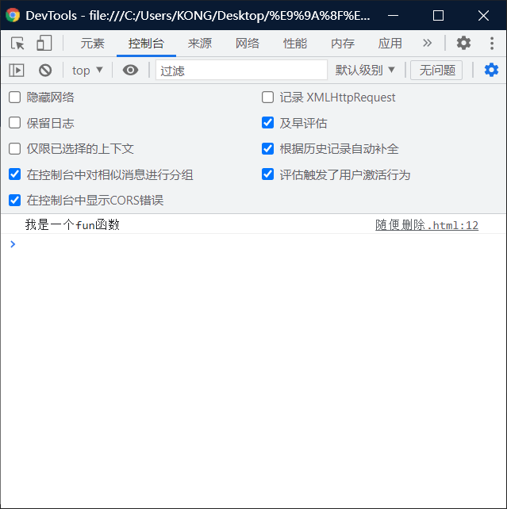
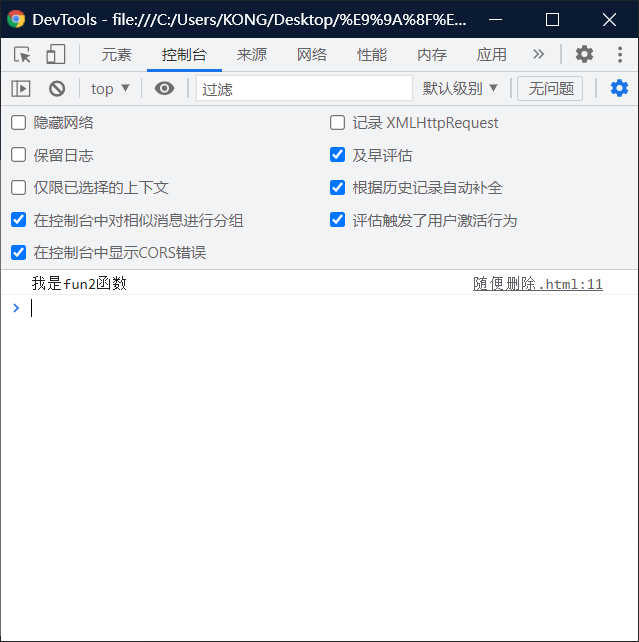

# 变量的声明提前（2）（全局作用域）：

# 变量的声明提前：

> - ==使用var关键字==声明的变量，会在所有的代码执行之前被声明（但是不会赋值），这样就会出现undefined。
> - 但是如果声明变量时==不使用关键字var==，则变量不会被声明提前，就会报错。

```html
<!DOCTYPE html>
<html lang="en">
<head>
    <meta charset="UTF-8">
    <meta http-equiv="X-UA-Compatible" content="IE=edge">
    <meta name="viewport" content="width=device-width, initial-scale=1.0">
    <title>Document</title>
    <script>

        console.log("a = " +  a)//notice: thereinto "" time , The space bar has a few empty a few.
        var a = 123;

        
        </script> 
</head>
<body>
    
</body>
</html>
```

# 函数的声明提前：

> - 使用函数声明形式创建的函数 function 函数 （）{ }
>   - 它会在所有的==代码执行之前就被创建==，所有我们可以在函数声明前来调用函数。
> - 即，不管我在哪里引用这个函数都可以得到。
> - 不想变量我需要在输出之前放置。

## 可以被调用：

> ## 函数声明：会被提前创建

```html
<!DOCTYPE html>
<html lang="en">
<head>
    <meta charset="UTF-8">
    <meta http-equiv="X-UA-Compatible" content="IE=edge">
    <meta name="viewport" content="width=device-width, initial-scale=1.0">
    <title>Document</title>
    <script>
        fun()
        function fun()
        {
            console.log("我是一个fun函数")
        }
    </script>
</head>
<body>
    
</body>
</html>
```



## 不可以被调用（表达式）：

> ## 函数表达式：不会被提前创建

```html
<!DOCTYPE html>
<html lang="en">
<head>
    <meta charset="UTF-8">
    <meta http-equiv="X-UA-Compatible" content="IE=edge">
    <meta name="viewport" content="width=device-width, initial-scale=1.0">
    <title>Document</title>
    <script>
        var fun2 = function()
        {
            console.log("我是fun2函数")
        }
        
        
        fun2()//只能在这里调用不能在var之前，调用
    </script>
</head>
<body>
    
</body>
</html>
```

