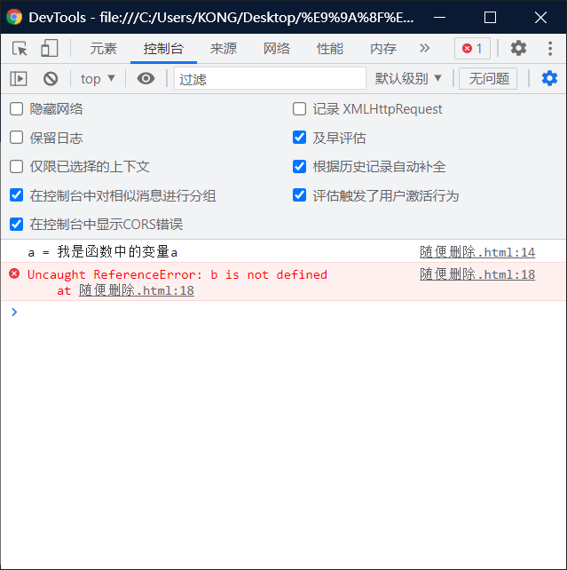
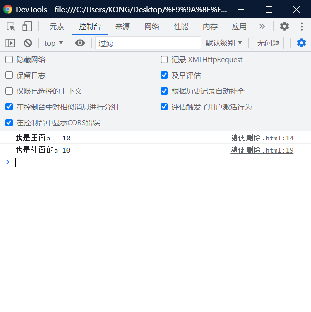

# 函数作用域：

> - 调用函数时创建函数作用域，函数执行完毕以后，函数作用域销毁。
> - 每调用一次函数就会创建一个新的函数作用域，他们之间是互相独立的。
> - 在==函数作用域==中==可以访问==到==全局作用域==的变量。
> - 在==全局作用域==中==无法访问==到==函数作用域==的变量。

> ## 注意：
>
> - 我们可以从里面看见外面。
> - 但是无法从外面看见里面。

## 可以在函数里面访问外面的变量

```html
<!DOCTYPE html>
<html lang="en">
<head>
    <meta charset="UTF-8">
    <meta http-equiv="X-UA-Compatible" content="IE=edge">
    <meta name="viewport" content="width=device-width, initial-scale=1.0">
    <title>Document</title>
    <script>
        //创建一个变量
        var a = 10;
        
        function fun(){
            console.log("a = " + a )
        }
        fun()
    </script>
</head>
<body>
    
</body>
</html>
```

## 不能再外面访问函数里面的东西

> - 如果，执意去写，就会报错。

```html
<!DOCTYPE html>
<html lang="en">
<head>
    <meta charset="UTF-8">
    <meta http-equiv="X-UA-Compatible" content="IE=edge">
    <meta name="viewport" content="width=device-width, initial-scale=1.0">
    <title>Document</title>
    <script>
        var a = 10;
        
        function fun(){
            var a = "我是函数中的变量a"
            var b = 20;
            console.log("a = " + a )
            
        }
        fun()
        console.log(b)  //证明了外面无法看里面
        // console.log(a)//证明了就近原则
       
    </script>
</head>
<body>
    
</body>
</html>
```



# 注意：

> - 当在函数作用域操作一个变量时，它会先在自身作用域中寻找，如果有就直接使用。
> - 如果==没有==则向==上一级作用域==中寻找。
> - 如果==全局作用域中依然没有找到==，则会报错Reference Error.

> - 在函数中要访问全局变量可以使用window对象。

```html
<!DOCTYPE html>
<html lang="en">
<head>
    <meta charset="UTF-8">
    <meta http-equiv="X-UA-Compatible" content="IE=edge">
    <meta name="viewport" content="width=device-width, initial-scale=1.0">
    <title>Document</title>
    <script>
        var a = 10;
        
        function fun(){
            var a = "我是函数中的变量a"
            var b = 20;
            console.log("我是里面a = " + window.a )
            
        }
        fun()
        console.log("我是外面的a " +  a)//证明了就近原则
       
    </script>
</head>
<body>
    
</body>
</html>
```



> - 可以看出两个都是10，和fun里面的`  var a = "我是函数中的变量a"`无关。
>   - `console.log("我是外面的a " +  a)`是直接从`  var a = 10;`里面得到的。
>   - 而` console.log("我是里面a = " + window.a )`也是`var a = 10;`中的。

# 注意点1：

> - 在函数中，==不使用var声明的变量==都会成为==全局变量==

```html
<!DOCTYPE html>
<html lang="en">
<head>
    <meta charset="UTF-8">
    <meta http-equiv="X-UA-Compatible" content="IE=edge">
    <meta name="viewport" content="width=device-width, initial-scale=1.0">
    <title>Document</title>
    <script>
        var c = 33;
        function fun(){
            console.log("c in = " + c);//33
            c = 10;//The global variable
            //因为，没有设置 var 关键字，导致c为全局变量
        }
        fun();
        console.log("c out = " + c)//10
    </script>
</head>
<body>
    
</body>
</html>
```

# 注意点2：

> - 定义==形参==就相当于==函数作用域中声明了变量==

```html
<!DOCTYPE html>
<html lang="en">
<head>
    <meta charset="UTF-8">
    <meta http-equiv="X-UA-Compatible" content="IE=edge">
    <meta name="viewport" content="width=device-width, initial-scale=1.0">
    <title>Document</title>
    <script>
        var a = 23;
        function fun(a){
            alert(a)
        }
        fun()//在其中加入想要的数字，就可以得到，只不过23已经没有用了，因为有形参
    </script>
</head>
<body>
    
</body>
</html>
```

