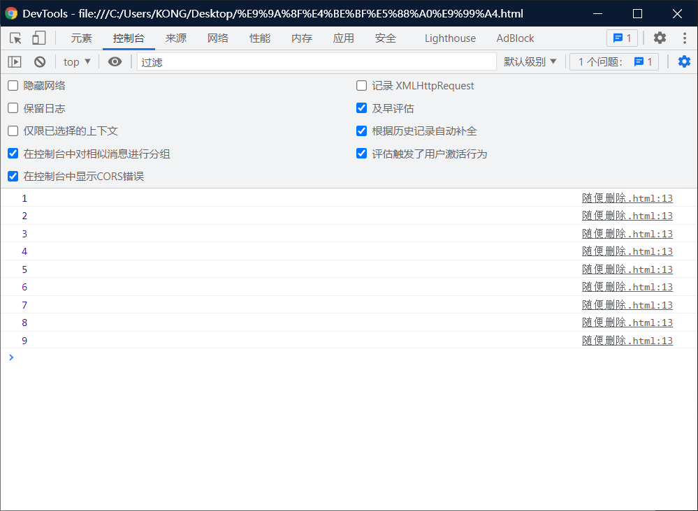
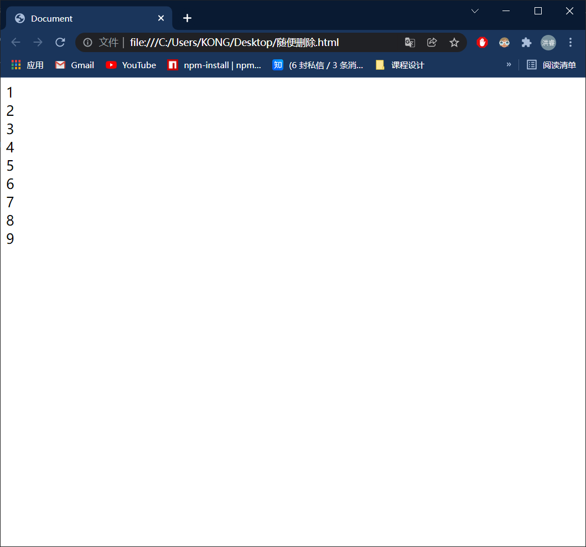
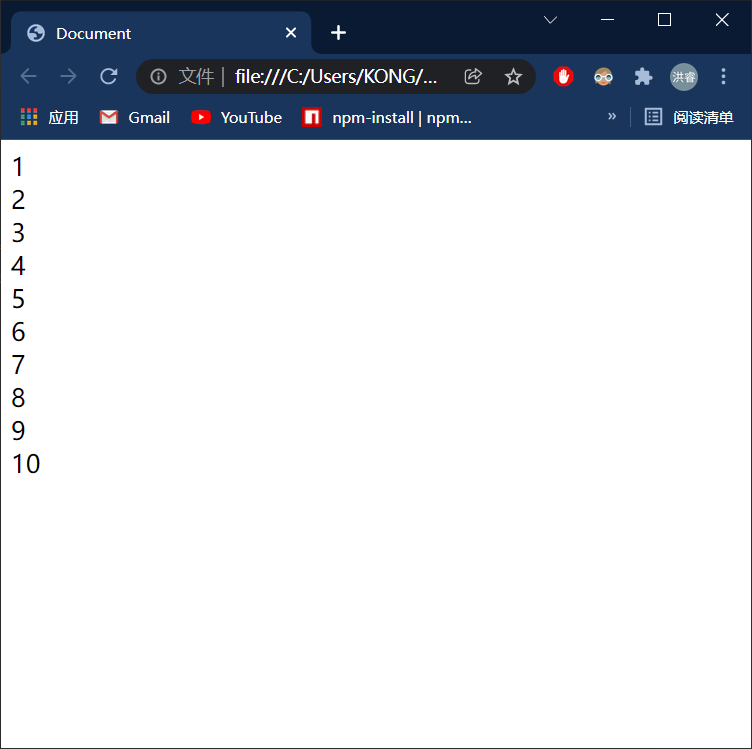
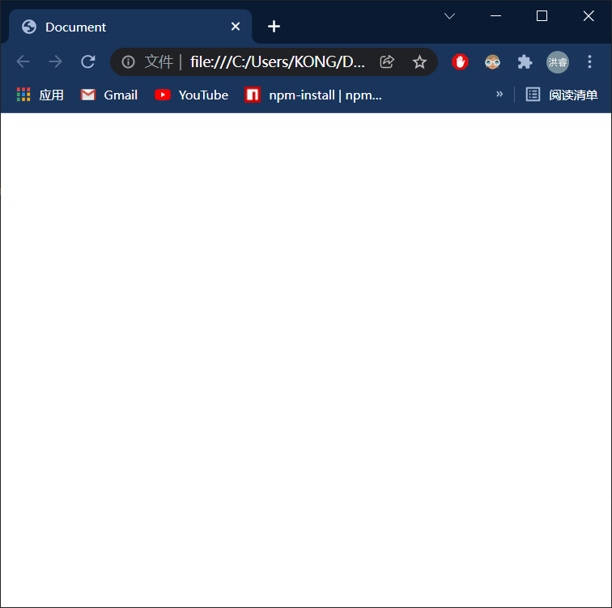
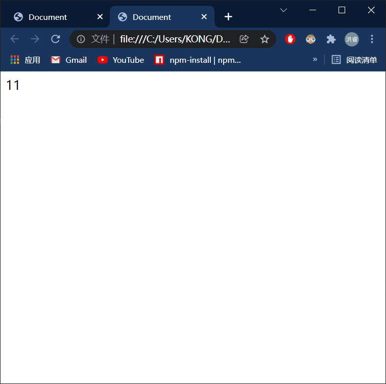

# while循环：

> 循环语句：
>
> - 通过循环语句可以反复的执行一段代码多次

# while循环介绍与使用：

> ## 语法：
>
>  while(条件表达式)
>
> {
>
> ​      语句···················
>
>   }

> ## 执行逻辑：
>
> - 先对条件表达式进行求值判断，
>   - 如果值为true，则执行循环体，
>     - 循环体执行完毕之后，继续对表达式进行判断
>     - 如果，为true，则继续执行循环体，以此类推。
>   - 如果值为false，则终止循环

> ## 创建循环需要的==步骤==（3步）
>
> 1. 创建一个初始化变量:
>
>    `var i = 0;`
>
> 2. 在循环中设置一个条件表达式：
>
> ```html
> while (i < 10) //重点
> {
>     alert(1) ;           
> }
> ```
>
> 3. 定义一个更新表达式，每次更新初始化变量：
>
> `i++ ;`

```html
<!DOCTYPE html>
<html lang="en">
<head>
    <meta charset="UTF-8">
    <meta http-equiv="X-UA-Compatible" content="IE=edge">
    <meta name="viewport" content="width=device-width, initial-scale=1.0">
    <title>Document</title>
    <script>
        // 向网页中输出连续的数字
        var n = 1;
        while(n < 10)
        {
            console.log(n++)

            // 判断 n 是否是 10
          
        } 
    </script>
</head>
<body>
    
</body>
</html>
```



# 注意：

> - 像这种将条件表达式写死为true的循环，叫做死循环。
> - 该循环不会停止，除非浏览器关闭，死循环在开发慎用

```html
<!DOCTYPE html>
<html lang="en">
<head>
    <meta charset="UTF-8">
    <meta http-equiv="X-UA-Compatible" content="IE=edge">
    <meta name="viewport" content="width=device-width, initial-scale=1.0">
    <title>Document</title>
    <script>
        // 向网页中输出连续的数字
        var n = 1 ;
        // 像这种将条件表达式写死为true的循环，叫做死循环。
        // 该循环不会停止，除非浏览器关闭，死循环在开发慎用
        while(true)
        {
            console.log(n++)
        } 
  
    </script>
</head>
<body>
    
</body>
</html>
```

## 解决办法：

> - 加入 if 语句 进行判断

### 方法一

```html
<!DOCTYPE html>
<html lang="en">
<head>
    <meta charset="UTF-8">
    <meta http-equiv="X-UA-Compatible" content="IE=edge">
    <meta name="viewport" content="width=device-width, initial-scale=1.0">
    <title>Document</title>
    <script>
        // 向网页中输出连续的数字
        var n = 1;
        while(true)
        {
            console.log(n++)

            // 判断 n 是否是 10
            if(n == 100)
            {
                // 退出循环
                break;
            }
        } 
    </script>
</head>
<body>
    
</body>
</html>
```

### 方法2：

```html
<!DOCTYPE html>
<html lang="en">
<head>
    <meta charset="UTF-8">
    <meta http-equiv="X-UA-Compatible" content="IE=edge">
    <meta name="viewport" content="width=device-width, initial-scale=1.0">
    <title>Document</title>
    <script>
        // 向网页中输出连续的数字
        var n = 1;
        while(n < 10)
        {
            document.write(n++ + "<br>")
            // 判断 n 是否是 10
          
        } 
    </script>
</head>
<body>
    
</body>
</html>
```



# do········while 循环：

> ## 语法：
>
> ​    do{
>
> ​      语句················
>
> ​    } while(条件表达式)

> ## 执行流程：
>
> - do···················while语句在执行时，会先执行循环体，
>   - 循环体执行完毕以后，再对while后的条件表达式进行判断，
>   - 如果，结果为 true ，则继续执行循环体，执行完毕继续判断以此类推，
>   - 如果，结果为false， 则终止循环。

```html
<!DOCTYPE html>
<html lang="en">
<head>
    <meta charset="UTF-8">
    <meta http-equiv="X-UA-Compatible" content="IE=edge">
    <meta name="viewport" content="width=device-width, initial-scale=1.0">
    <title>Document</title>
    <script>
          var n = 1;
        do{
            document.write(n++ + "<br>")

        }while(n <= 10)

    </script>
</head>
<body>
    
</body>
</html>
```



# do··········while和while的区别：

> 实际上这两个语句功能类似，
>
> - 不同的
> - 是while是先判断后执行。：而while不能保证循环体至少执行一次（在条件不满足的情况下）
> - 是do···············while是先执行后判断：可以保证循环体至少执行一次（在条件不满足的情况下）

## while：而while不能保证循环体至少执行一次（在条件不满足的情况下）

```html
<!DOCTYPE html>
<html lang="en">
<head>
    <meta charset="UTF-8">
    <meta http-equiv="X-UA-Compatible" content="IE=edge">
    <meta name="viewport" content="width=device-width, initial-scale=1.0">
    <title>Document</title>
    <script>
          var n = 11;
        while(n <= 10){
            document.write(n++ + "<br>")

        }

    </script>
</head>
<body>
    
</body>
</html>
```



## do···········while：可以保证循环体至少执行一次（在条件不满足的情况下）

```html
<!DOCTYPE html>
<html lang="en">
<head>
    <meta charset="UTF-8">
    <meta http-equiv="X-UA-Compatible" content="IE=edge">
    <meta name="viewport" content="width=device-width, initial-scale=1.0">
    <title>Document</title>
    <script>
          var n = 11;
        do{
            document.write(n++ + "<br>")

        }while(n <= 10)

    </script>
</head>
<body>
    
</body>
</html>
```

