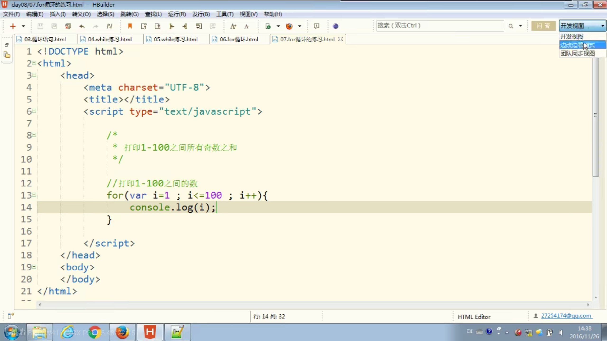
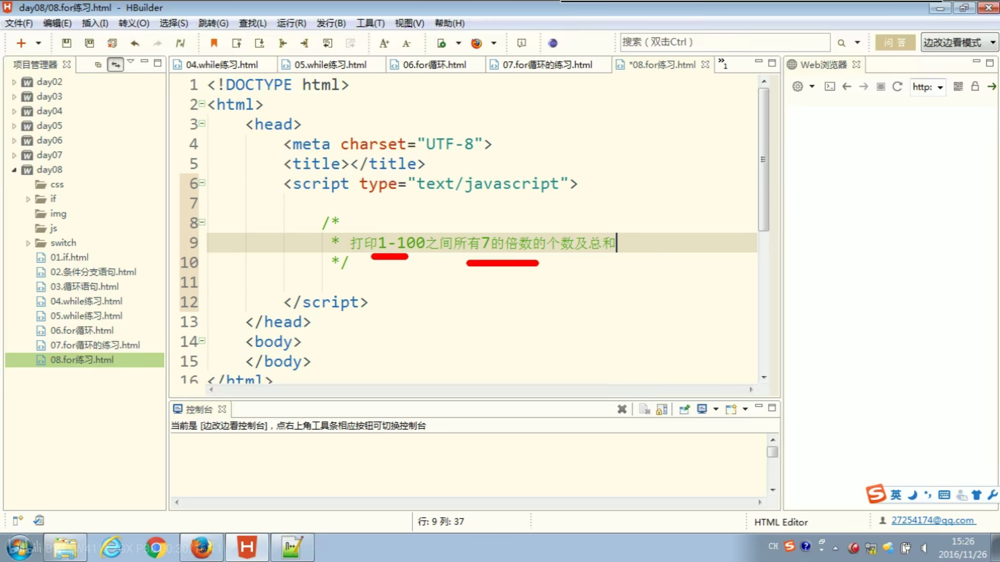
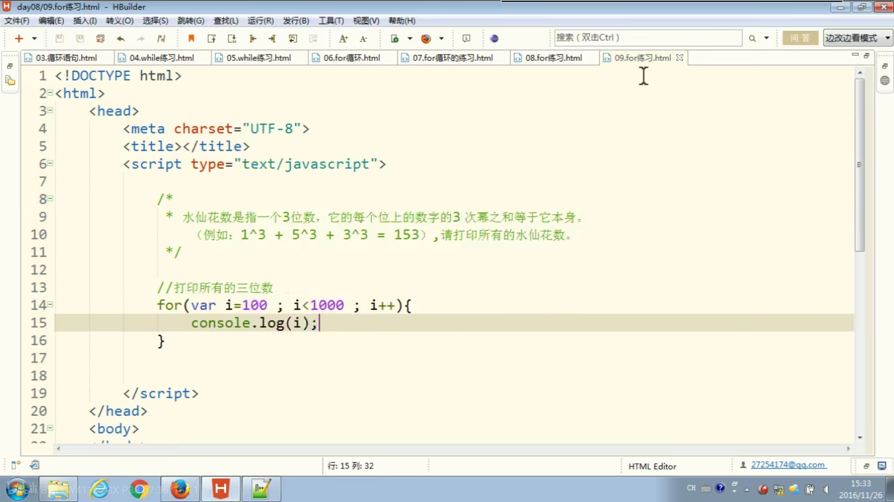

# for循环的练习：

# 题目一：



```html
<!DOCTYPE html>
<html lang="en">
<head>
    <meta charset="UTF-8">
    <meta http-equiv="X-UA-Compatible" content="IE=edge">
    <meta name="viewport" content="width=device-width, initial-scale=1.0">
    <title>Document</title>
    <script>
        // 创建一个变量，用来保存奇数之和
        var sum = 0;
        // 打印1——100之间的数字
       for(var i = 1 ; i <=100 ; i++)
       {
        if(i % 2 != 0)
        {
            console.log(i)            
            sum = sum + i;
        }

       } 
       console.log('奇数之和为:'+sum)

    </script>
</head>
<body>
    
</body>
</html>
```

# 题目二：

> ## 注意：
>
> i % 7 == 0 ； 意思是 i 可以被7整除
>
> i % 2 == 0 ;    意思是 i 是偶数
>
> i % 2 !=0;   	 意思是i 是奇数 



```html
<!DOCTYPE html>
<html lang="en">
<head>
    <meta charset="UTF-8">
    <meta http-equiv="X-UA-Compatible" content="IE=edge">
    <meta name="viewport" content="width=device-width, initial-scale=1.0">
    <title>Document</title>
    <script>
        // 定义一个变量，来保存总和
        var sum = 0;

        // 定义一个计数器，来记录数量
        var count = 0;
        //打印1——100之间所有的数
        for(var i = 1;i<=100;i++  )
        {
            //判断i是否是7的倍数
            if(i%7 == 0){
                console.log(i);
                sum = sum + i;
                // 使计数器自增1
                count++;
            }
        }
        console.log('总数之和：'+sum)
        console.log('总共使用次数：'+count)
    </script>
</head>
<body>
    
</body>
</html>
```

# 题目三：



```html
```

