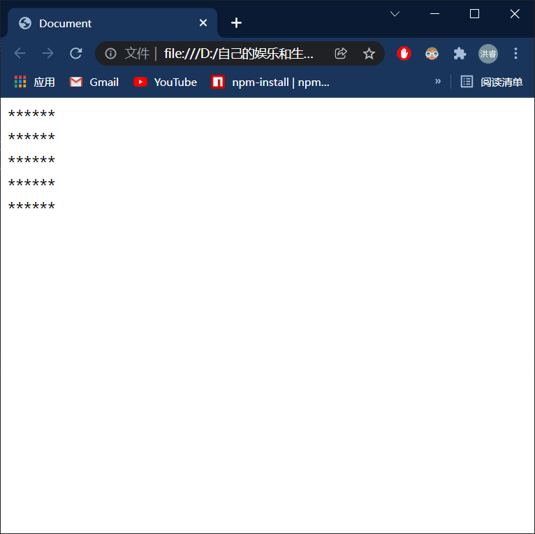
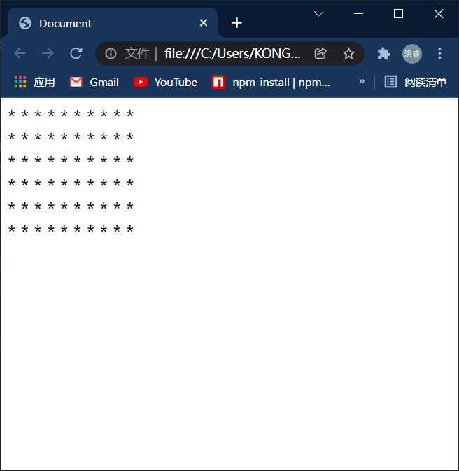
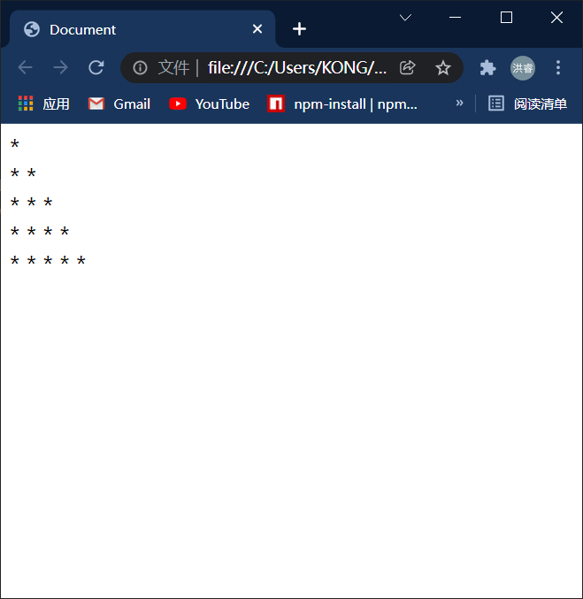
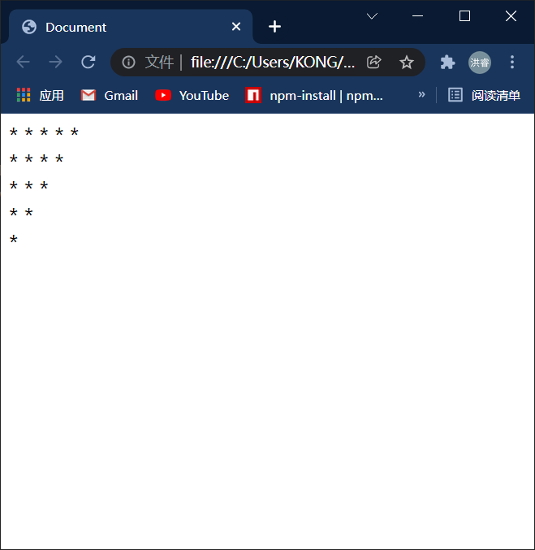

# 嵌套的for循环：



```html
<!DOCTYPE html>
<html lang="en">
<head>
    <meta charset="UTF-8">
    <meta http-equiv="X-UA-Compatible" content="IE=edge">
    <meta name="viewport" content="width=device-width, initial-scale=1.0">
    <title>Document</title>
    <script>
          for(var i = 0 ; i<=5;i++){
            document.write("******" + "<br>")
        }

    </script>
</head>
<body>
    
</body>
</html>
```

# 嵌套for例子：

## 第一个：

```html
<!DOCTYPE html>
<html lang="en">
<head>
    <meta charset="UTF-8">
    <meta http-equiv="X-UA-Compatible" content="IE=edge">
    <meta name="viewport" content="width=device-width, initial-scale=1.0">
    <title>Document</title>
    <script>
          for(var i = 0 ; i<6;i++)//决定有多高
          {
            // 再循环的内部再创建一个循环，又来控制图形的宽度
            // 目前我们的外部的for循环执行1次，内部的就会执行5次


            // 内层循环可以来决定图形的宽度，执行几次图形的宽度就是多少
              for(var j =0 ;j<5 ;j++)//每一行有几个星星
              {
                document.write("* * ")
              }
              document.write("<br>")
        }

    </script>
</head>
<body>
    
</body>
</html>
```



## 第二个：

```html
<!DOCTYPE html>
<html lang="en">
<head>
    <meta charset="UTF-8">
    <meta http-equiv="X-UA-Compatible" content="IE=edge">
    <meta name="viewport" content="width=device-width, initial-scale=1.0">
    <title>Document</title>
    <script>
     for(var i = 0; i < 5 ;i++)
     {
         for(var j = 0 ; j <i + 1; j++)//宽
         {
             document.write(" * ")
         }
         document.write("<br>")
     }
    </script>
</head>
<body>
    
</body>
</html>
```



## 第三个：

```html
<!DOCTYPE html>
<html lang="en">
<head>
    <meta charset="UTF-8">
    <meta http-equiv="X-UA-Compatible" content="IE=edge">
    <meta name="viewport" content="width=device-width, initial-scale=1.0">
    <title>Document</title>
    <script>
     for(var i = 0; i < 5 ;i++)
     {
         for(var j = 0 ; j <5-i; j++)
         {
             document.write(" * ")
         }
         document.write("<br>")
     }
    </script>
</head>
<body>
    
</body>
</html>
```

