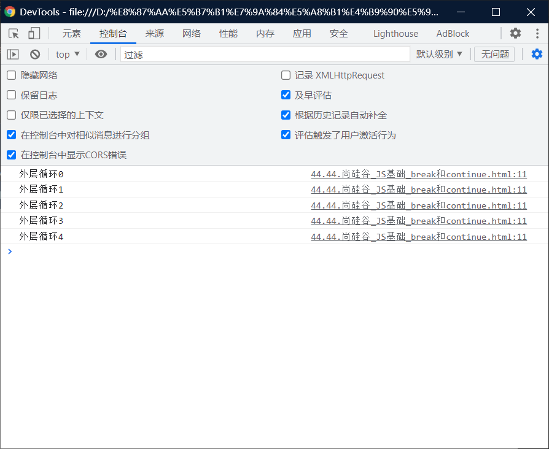

# break和continue：

# 一、break：

> - break关键字可以用来退出==Switch==或==循环语句==

## 1、注意：

> - 不能在==if语句==中使用break和continue
> - break关键字，会立即终止==离他最近==的那个循环语句


```html
```

## 2、break终止的几种情况：

### （1）break在==第一个==for的里面:

> 只有一个外层循环，内层循环全部都有

```html
<!DOCTYPE html>
<html lang="en">
<head>
    <meta charset="UTF-8">
    <meta http-equiv="X-UA-Compatible" content="IE=edge">
    <meta name="viewport" content="width=device-width, initial-scale=1.0">
    <title>Document</title>
    <script>
    for(var i = 0; i < 5;i++)
    {
        console.log("外层循环"+i)
        for(var j = 0; j< 5;j++)
        {
           
            console.log("内存循环"+j);
        }
        break 
    }
    </script>
</head>
<body>
    
</body>
</html>
```


### （2）break在==第二个f==or里面：

> 只有外层循环，无内层循环

```html
<!DOCTYPE html>
<html lang="en">
<head>
    <meta charset="UTF-8">
    <meta http-equiv="X-UA-Compatible" content="IE=edge">
    <meta name="viewport" content="width=device-width, initial-scale=1.0">
    <title>Document</title>
    <script>
    for(var i = 0; i < 5;i++)
    {
        console.log("外层循环"+i)
        for(var j = 0; j< 5;j++)
        {
            break 
            console.log("内存循环"+j);
        }
        
    }
    </script>
</head>
<body>
    
</body>
</html>
```



### （3）break在第二个循环里，但是可以同时关闭第一个循环和第二个循环

> - 可以为循环语句创建一个label，来标识当前的循环。
> -  label：循环语句
> -  使用break语句时，可以在break后跟着一个label，这样break将会结束指定的循环，而不是最近的。

```html
<!DOCTYPE html>
<html lang="en">
<head>
    <meta charset="UTF-8">
    <meta http-equiv="X-UA-Compatible" content="IE=edge">
    <meta name="viewport" content="width=device-width, initial-scale=1.0">
    <title>Document</title>
    <script>
    // 可以为循环语句创建一个label，来标识当前的循环
    // label：循环语句
    // 使用break语句时，可以在break后跟着一个label，这样break将会结束指定的循环，而不是最近的。
    outer:
    for(var i = 0; i < 5;i++)
    {
        console.log("外层循环"+i)
        for(var j = 0; j< 5;j++)
        {
           
            console.log("内存循环"+j);
        }
        break 
    }
    </script>
</head>
<body>
    
</body>
</html>
```


# 二、continue：

> continue关键字可以用来跳过当次循环。
>
> - 可以从下图看出，内层循环的1没有了。
>
> - 如果想要把外层循环也干掉，就像break一样弄一个label

```html
<!DOCTYPE html>
<html lang="en">
<head>
    <meta charset="UTF-8">
    <meta http-equiv="X-UA-Compatible" content="IE=edge">
    <meta name="viewport" content="width=device-width, initial-scale=1.0">
    <title>Document</title>
    <script>
        for(var i = 0; i < 5;i++)
    {
        console.log("外层循环"+i)
        for(var j = 0; j< 5;j++)
        {
           if(j == 1) {
                continue;
           }
            console.log("内存循环"+j);
        }
        
    }
    </script>
</head>
<body>
    
</body>
</html>
```


# 三、个人对于for语句中console的认识：

没哟