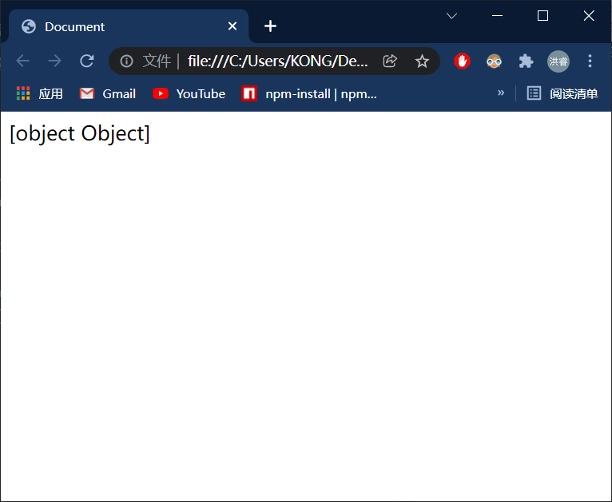
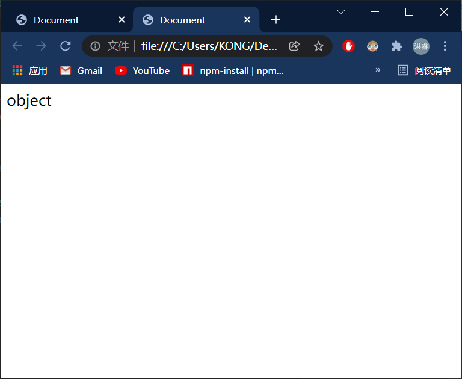
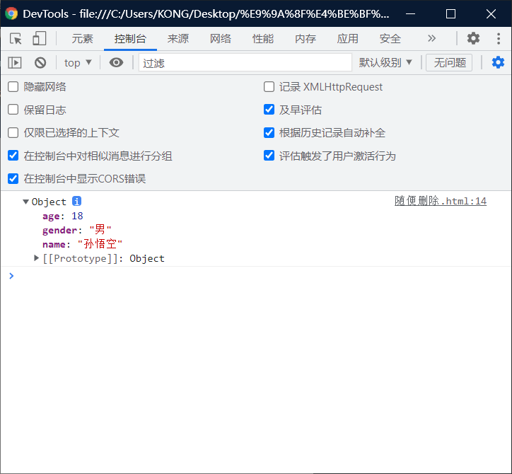
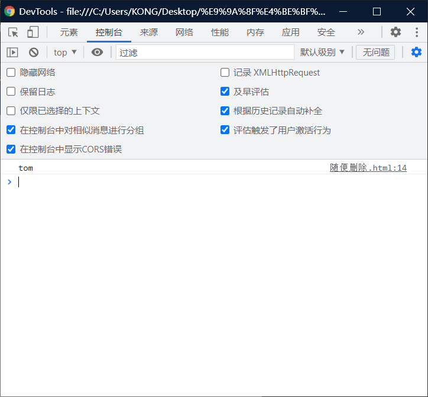
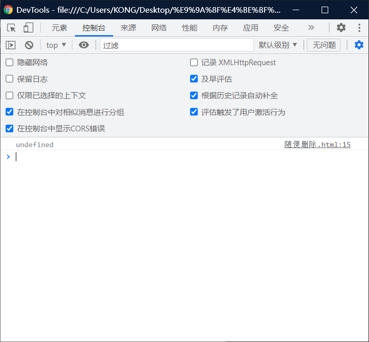

# 对象的基本操作：

# 创建对象：

> - 使用new关键字调用的函数，是构造函数 constructor
> - 构造函数是专门用来创建对象的函数

```html
<!DOCTYPE html>
<html lang="en">
<head>
    <meta charset="UTF-8">
    <meta http-equiv="X-UA-Compatible" content="IE=edge">
    <meta name="viewport" content="width=device-width, initial-scale=1.0">
    <title>Document</title>
    <script>
        var obj = new Object();
        document.write(obj)
    </script>
</head>
<body>
    
</body>
</html>
```



> 别问我为什么会出现这个，我也不知道。

# 检查object的类型：

> 使用 typeof 

```html
<!DOCTYPE html>
<html lang="en">
<head>
    <meta charset="UTF-8">
    <meta http-equiv="X-UA-Compatible" content="IE=edge">
    <meta name="viewport" content="width=device-width, initial-scale=1.0">
    <title>Document</title>
    <script>
        var obj = new Object();
        document.write(typeof obj)
    </script>
</head>
<body>
    
</body>
</html>
```



# 对象的使用语法：

## 把不同的属性集合（增）：

> 在对象中保存的值称为属性
>
> 向对象添加属性
>
> - 语法 ： 对象 . 属性名 = 属性值；

> 

```html
<!DOCTYPE html>
<html lang="en">
<head>
    <meta charset="UTF-8">
    <meta http-equiv="X-UA-Compatible" content="IE=edge">
    <meta name="viewport" content="width=device-width, initial-scale=1.0">
    <title>Document</title>
    <script>
        var obj = new Object();
        obj.name = "孙悟空";
        obj.gender = "男";
        obj.age = 18;
        // document.write(obj)
        console.log(obj)
    </script>
</head>
<body>
    
</body>
</html>
```



## 把不同的属性提取出来（查）：

> - 读取对象中的属性：
>   - 语法 ： 对象 . 属性名
> - 如果读取对象中没有属性，不会报错而是会返回undefined。

```html
<!DOCTYPE html>
<html lang="en">
<head>
    <meta charset="UTF-8">
    <meta http-equiv="X-UA-Compatible" content="IE=edge">
    <meta name="viewport" content="width=device-width, initial-scale=1.0">
    <title>Document</title>
    <script>
        var obj = new Object();
        obj.name = "孙悟空";
        obj.gender = "男";
        obj.age = 18;
        console.log(obj.name)
    </script>
</head>
<body>
    
</body>
</html>
```


## 修改对象的属性值（改）：

> 语法： 对象 . 属性名 = 新值

```html
<!DOCTYPE html>
<html lang="en">
<head>
    <meta charset="UTF-8">
    <meta http-equiv="X-UA-Compatible" content="IE=edge">
    <meta name="viewport" content="width=device-width, initial-scale=1.0">
    <title>Document</title>
    <script>
        var obj = new Object();
        obj.name = "孙悟空";
        obj.gender = "男";
        obj.age = 18;
        obj.name = "tom"
        console.log(obj.name)//谁挨着这哥们近，他就跟谁。
       
    </script>
</head>
<body>
    
</body>
</html>
```



## 删除对象的属性（删）：

> 语法 ： delete 对象 . 属性名

```html
<!DOCTYPE html>
<html lang="en">
<head>
    <meta charset="UTF-8">
    <meta http-equiv="X-UA-Compatible" content="IE=edge">
    <meta name="viewport" content="width=device-width, initial-scale=1.0">
    <title>Document</title>
    <script>
        var obj = new Object();
        obj.name = "孙悟空";
        obj.gender = "男";
        obj.age = 18;
        obj.name = "tom"
        delete obj.name;
        console.log(obj.name)
       
    </script>
</head>
<body>
    
</body>
</html>
```

