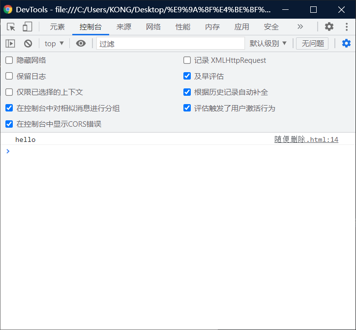
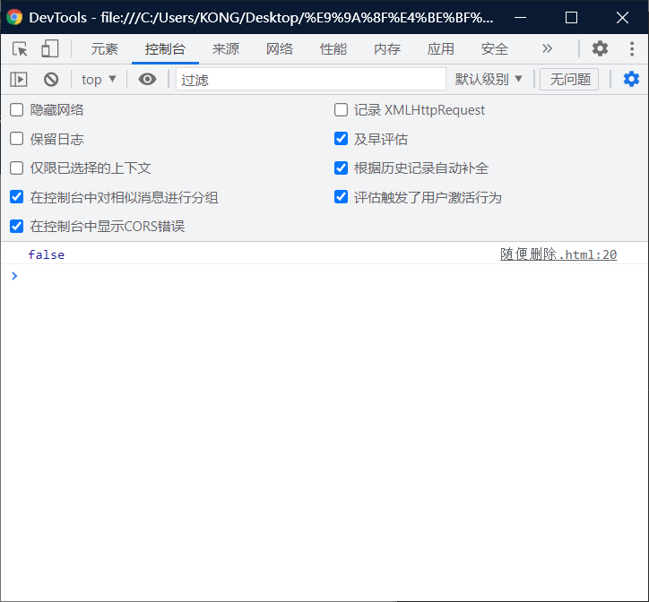

# 属性名和属性值：

# 属性名：

> - 对象的属性名==不强制==要求遵守标识符的规范
>   - 什么==烂七八糟==的名字都可以使用
> - ==但是我们使用时，还是尽量按照标识符的规范去做==

```html
<!DOCTYPE html>
<html lang="en">
<head>
    <meta charset="UTF-8">
    <meta http-equiv="X-UA-Compatible" content="IE=edge">
    <meta name="viewport" content="width=device-width, initial-scale=1.0">
    <title>Document</title>
    <script>
        var obj = new Object();
        obj.name = "The Monkey King"
        obj.var = "TOM"//It's an outlier.
        console.log(obj.var)
    </script>
</head>
<body>
    
</body>
</html>
```

## 特殊情况：

## 作用之一：

> 如果要使用特殊的属性名，==不能采用 . 的方式来操作==
>
> - 需要使用另一种方式
>   - 语法：
>   - ==对象 [ " 属性名 " ] = 属性值==
> - 读取的时候，也需要采用这种方式。

```html
<!DOCTYPE html>
<html lang="en">
<head>
    <meta charset="UTF-8">
    <meta http-equiv="X-UA-Compatible" content="IE=edge">
    <meta name="viewport" content="width=device-width, initial-scale=1.0">
    <title>Document</title>
    <script>
       var obj = new Object();
        obj["123"] = 789//We need to be careful,There are no points,So when we go to the console.log,we need don't write points.just like "obj["123"]".
        
        console.log(obj["123"])//such as,Anyway, I think the left property name , can Write directly to the console.
    </script>
</head>
<body>
    
</body>
</html>
```

## 作用之二：

> - 使用[ ]这种形式去==操作属性，更加灵活==
>   - 在[ ]中可以==直接传递一个变量==，这样变量值是多少就会读取那个属性。

```html
<!DOCTYPE html>
<html lang="en">
<head>
    <meta charset="UTF-8">
    <meta http-equiv="X-UA-Compatible" content="IE=edge">
    <meta name="viewport" content="width=device-width, initial-scale=1.0">
    <title>Document</title>
    <script>
       var obj = new Object();
        obj["123"] = 789
        obj["nihao"] = "hello"

        var n = "nihao"// Variables are important in JavaScript,at the same time , variables can Better and easier work for programmers .
        console.log(obj[n])//very important
    </script>
</head>
<body>
    
</body>
</html>
```



# 属性值：

> JS对象的属性值，可以是==任意的数据类型==
>
> - 甚至也可以是一个对象

## 例子1：

```html
<!DOCTYPE html>
<html lang="en">
<head>
    <meta charset="UTF-8">
    <meta http-equiv="X-UA-Compatible" content="IE=edge">
    <meta name="viewport" content="width=device-width, initial-scale=1.0">
    <title>Document</title>
    <script>
    var obj = new Object();
      obj.test = true;
      obj.test = null;
      obj.test = undefined;

      //Create an object
      var obj2 = new Object();
      obj2.name = "Pig eight quit"

      //Set object 2 as a property of object 1
      obj.test = obj2;
      console.log(obj.test);
    </script>
</head>
<body>
    
</body>
</html>
```

## 例子2：

```html
<!DOCTYPE html>
<html lang="en">
<head>
    <meta charset="UTF-8">
    <meta http-equiv="X-UA-Compatible" content="IE=edge">
    <meta name="viewport" content="width=device-width, initial-scale=1.0">
    <title>Document</title>
    <script>
    var obj = new Object();
      obj.test = true;
      obj.test = null;
      obj.test = undefined;

      //Create an object
      var obj2 = new Object();
      obj2.name = "Pig eight quit"

      //Set object 2 as a property of object 1
      obj.test = obj2;
      console.log(obj.test.name);//Item changes
        //It's going to be obj to test to obj2.name then implementation the function.
    </script>
</head>
<body>
    
</body>
</html>
```

# in运算符：

> - 通过该运算符可以检查一个对象中是否含有指定的属性
>   - 如果有则返回true，没有则返回false

> ## 语法：
>
> ` "属性名" in 对象 `

```html
<!DOCTYPE html>
<html lang="en">
<head>
    <meta charset="UTF-8">
    <meta http-equiv="X-UA-Compatible" content="IE=edge">
    <meta name="viewport" content="width=device-width, initial-scale=1.0">
    <title>Document</title>
    <script>
    var obj = new Object();
      obj.test = true;
      obj.test = null;
      obj.test = undefined;

      //Create an object
      var obj2 = new Object();
      obj2.name = "Pig eight quit"

      //Set object 2 as a property of object 1
      obj.test = obj2;
      console.log("test2" in obj);
    </script>
</head>
<body>
    
</body>
</html>
```


