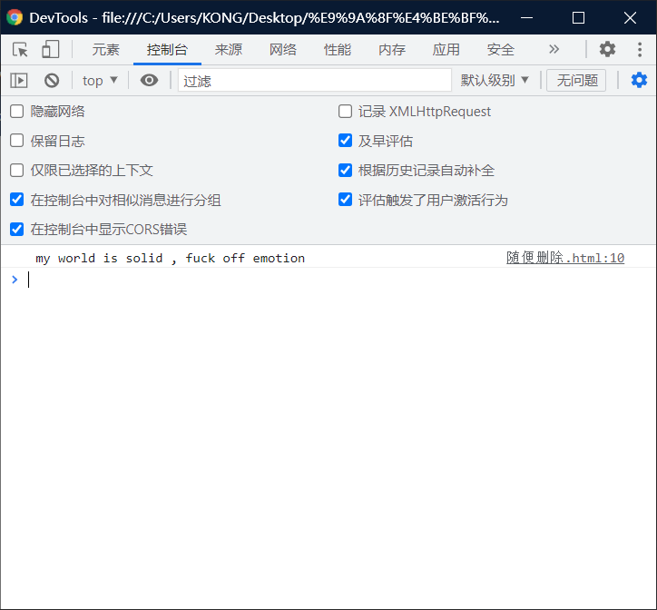

# 函数的简介：

> - 函数（function）也是一个对象
> - 函数中可以==封装一些功能（代码）==，在需要时可以执行这些功能（代码）。
> - 函数中可以保存一些代码在需要的时候调用。
> - 使用typeof检查一个函数对象时，会返回function

<hr>


## 创建一个函数对象：

> - 可以将要封装的代码以字符串的形式传递给构造函数.
> - 我们在实际开发中很少使用构造函数来创建一个函数对象。
> - `  var i = new Function("console.log('hello , this is my first function')");`

> - 封装到函数中的代码不会立即执行
> - 函数中的代码会在函数调用的时候执行。
> - 调用函数
>   - 语法：
>     - 函数对象 （ ）
>     - such as ： i(  );
> - 

```html
<!DOCTYPE html>
<html lang="en">
<head>
    <meta charset="UTF-8">
    <meta http-equiv="X-UA-Compatible" content="IE=edge">
    <meta name="viewport" content="width=device-width, initial-scale=1.0">
    <title>Document</title>
    <script>
        var i = new Function("console.log('hello , this is my first function')");
       	i ();
    </script>
</head>
<body>
    
</body>
</html>
```


# 优点：

> - 可以多次调用：
> - 当调用函数时，函数中封装的代码会按照顺序执行。

```html
<!DOCTYPE html>
<html lang="en">
<head>
    <meta charset="UTF-8">
    <meta http-equiv="X-UA-Compatible" content="IE=edge">
    <meta name="viewport" content="width=device-width, initial-scale=1.0">
    <title>Document</title>
    <script>
        var i = new Function("console.log('hello , this is my first function')");
       	i ();//attention
       	i ();//attention
       	i ();//attention
    </script>
</head>
<body>
    
</body>
</html>
```


可以看见其中有一个3.

# 函数声明（常用）：

> 使用 函数声明 来创建一个函数：
>
> - 语法：
>   - `function 函数名( [ 形参1 ， 形参2 ·········形参N ] ){  语句   }`

> 个人认为：和对象字面量差不多

```html
<!DOCTYPE html>
<html lang="en">
<head>
    <meta charset="UTF-8">
    <meta http-equiv="X-UA-Compatible" content="IE=edge">
    <meta name="viewport" content="width=device-width, initial-scale=1.0">
    <title>Document</title>
    <script>
        function i (){
            console.log("这是我的第二个函数~~~~")
            alert("hahaha")
            document.write("mc")
        }
        i();
    </script>
</head>
<body>
    
</body>
</html>
```

# 函数表达式：

> - 使用 函数表达式 来创建一个函数
> - 语法：
>   - `var 函数名 = function( [ 形参1 ， 形参2 ········形参N ] )`
> - 将匿名函数赋值给一个变量。

```html
<!DOCTYPE html>
<html lang="en">
<head>
    <meta charset="UTF-8">
    <meta http-equiv="X-UA-Compatible" content="IE=edge">
    <meta name="viewport" content="width=device-width, initial-scale=1.0">
    <title>Document</title>
    <script>
       var i3 = function(){
           console.log(" my world is solid , fuck off emotion")
       }
       i3()
    </script>
</head>
<body>
    
</body>
</html>
```



