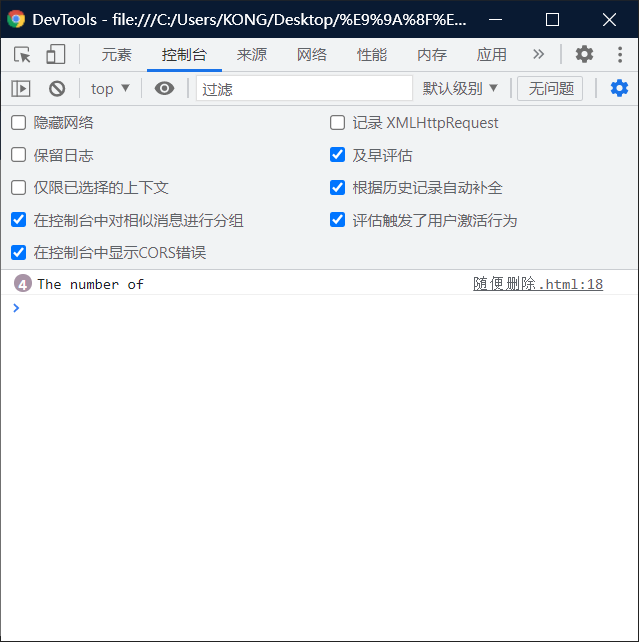
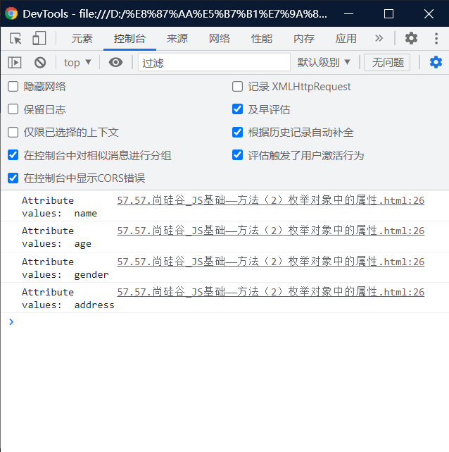
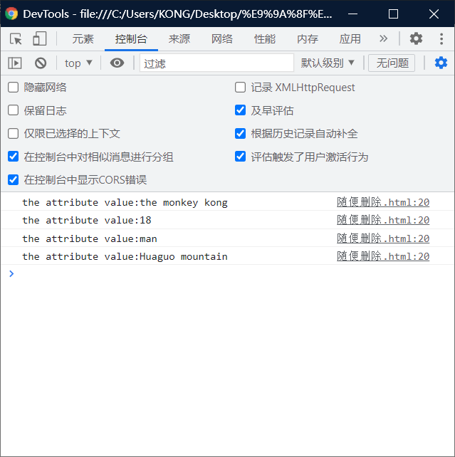

# 枚举对象中的属性：

# for··············in ：

> - 枚举对象中的属性
> - 使用for········in 语句
>   - 语法：
>   - `for(var 变量 in 对象){}`
> - 每次执行时，会将对象中的一个属性的名字赋值给变量。
> - 

## 知道其中有几个属性：

```html
<!DOCTYPE html>
<html lang="en">
<head>
    <meta charset="UTF-8">
    <meta http-equiv="X-UA-Compatible" content="IE=edge">
    <meta name="viewport" content="width=device-width, initial-scale=1.0">
    <title>Document</title>
    <script>
        var obj = {
            name:"the monkey kong",
            age:18,
            gender:"man",
            address:"Huaguo mountain"
        }
        //以下为枚举代码
        for (var n in obj)
        {
            console.log("The number of")
            // console.log("Attribute values" + n)//属性名字

        }
    </script>
</head>
<body>
    
</body>
</html>
```



可以从中看出有4个。

## 知道每一个属性的名字：

```html
<!DOCTYPE html>
<html lang="en">
<head>
    <meta charset="UTF-8">
    <meta http-equiv="X-UA-Compatible" content="IE=edge">
    <meta name="viewport" content="width=device-width, initial-scale=1.0">
    <title>Document</title>
    <script>
        var obj = {
            name:"the monkey kong",
            age:18,
            gender:"man",
            address:"Huaguo mountain"
        }
 		//以下为枚举代码
        for (var n in obj)
        {
            // console.log("The number of")
            console.log("Attribute names" + n)//属性名字
		    console.log("the attribute value:" + [n])//和上面的结果一样
        }
    </script>
</head>
<body>
    
</body>
</html>
```




## 知道属性==值==

> - notice：就是个n加上一个中括号
> - `[n]`

```html
<!DOCTYPE html>
<html lang="en">
<head>
    <meta charset="UTF-8">
    <meta http-equiv="X-UA-Compatible" content="IE=edge">
    <meta name="viewport" content="width=device-width, initial-scale=1.0">
    <title>Document</title>
    <script>
        var obj = {
            name:"the monkey kong",
            age:18,
            gender:"man",
            address:"Huaguo mountain"
        }
        //以下为枚举代码
        for (var n in obj)
        {
            // console.log("The number of")
            // console.log("Attribute name:" + n)//属性名字
            console.log("the attribute values:" + [n])
        }
    </script>
</head>
<body>
    
</body>
</html>
```

