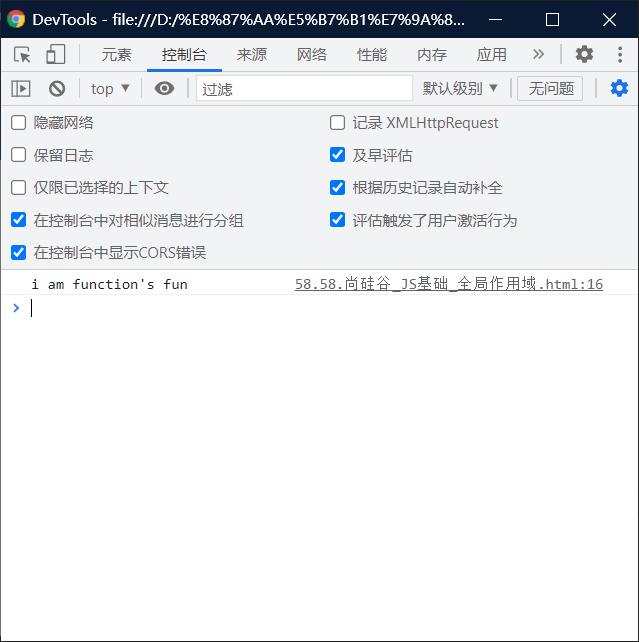

# 全局作用域（需要记忆）：

> 在JS中一共有两种作用域
>
> - 函数和方法没有区别，==一般函数都是window的方法==

--------


> - ## 全局作用域(不常用）：
>
>   - 直接编写在script标签中的JS代码，全局作用域
>   - 全局作用域在页面打开时创建，在页面关闭时销毁。
>   - 在全局作用域中有一个全局对象window，
>     - 它代表的是一个浏览器的窗口，它由浏览器创建
>     - 我们可以直接使用。
>   - 全局作用域中的==变量==都是==全局变量==
>     - 在页面的任意的部分都可以访问的到。
>   - 在全局作用域中：
>     - ==创建的变量都会作为window对象的属性保存。==
>     - ==创建的函数都会作为window对象的方法保存。==

----

```html
<!DOCTYPE html>
<html lang="en">
<head>
    <meta charset="UTF-8">
    <meta http-equiv="X-UA-Compatible" content="IE=edge">
    <meta name="viewport" content="width=device-width, initial-scale=1.0">
    <title>需要记忆</title>
    <script>
        function fun(){
            console.log("i am function's fun")
        }
        window.fun();//注意：window一般是为了变量不报错，一般没啥用。了解即可。
    </script>
</head>
<body>
    
</body>
</html>
```



# 作用域：

> - 作用域指一个变量的作用的范围

