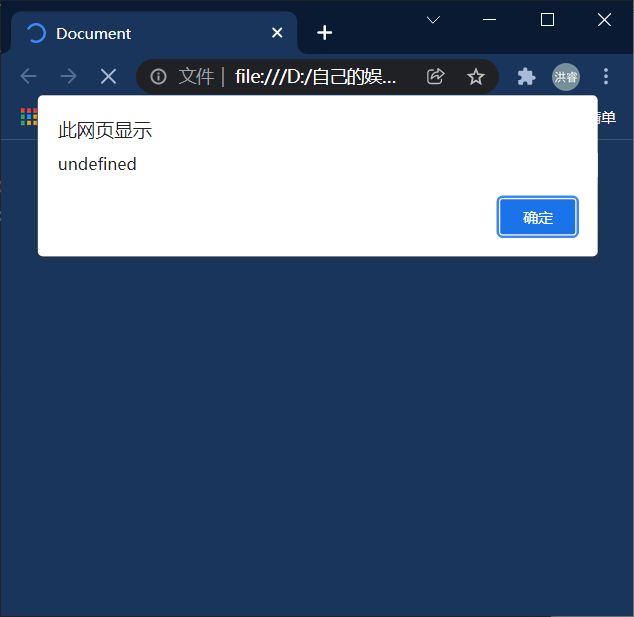
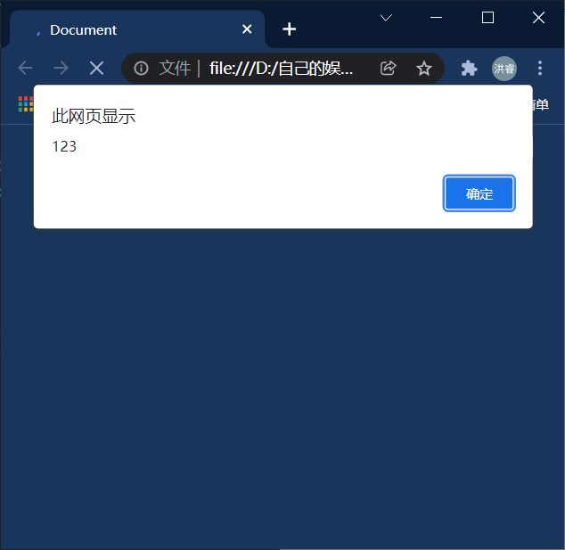

# 习题：

# 第一题：

```html
<!DOCTYPE html>
<html lang="en">
<head>
    <meta charset="UTF-8">
    <meta http-equiv="X-UA-Compatible" content="IE=edge">
    <meta name="viewport" content="width=device-width, initial-scale=1.0">
    <title>Document</title>
    <script>
        var a = 123;
        function fun()
        {
            alert(a);
        }
        fun()
    </script>
</head>
<body>
    
</body>
</html>
```


# 第二题：

> - 其中，里面的`alert(a)`输出undefined，外面的`alert(a)`输出10

```html
<!DOCTYPE html>
<html lang="en">
<head>
    <meta charset="UTF-8">
    <meta http-equiv="X-UA-Compatible" content="IE=edge">
    <meta name="viewport" content="width=device-width, initial-scale=1.0">
    <title>Document</title>
    <script>
    var a = 123;
    function fun ( ) 
    {
        alert(a) ;
        var a =456;
    }
    fun ( ) ;
    alert (a) ;

    </script>
</head>
<body>
    
</body>
</html>
```

### 第一个结果：



### 第二个结果：



# 第三题：

```html
<!DOCTYPE html>
<html lang="en">
<head>
    <meta charset="UTF-8">
    <meta http-equiv="X-UA-Compatible" content="IE=edge">
    <meta name="viewport" content="width=device-width, initial-scale=1.0">
    <title>Document</title>
    <script>
        var a =123;
        function fun () 
        {
            alert(a);//因为没有变量，所以去外面找；123
            a=456;//全局变量，导致外面456
        }
        fun ( ) ;
        alert (a) ;//456

    </script>
</head>
<body>
    
</body>
</html>
```

## 第一个结果：


## 第二个结果：


# 


