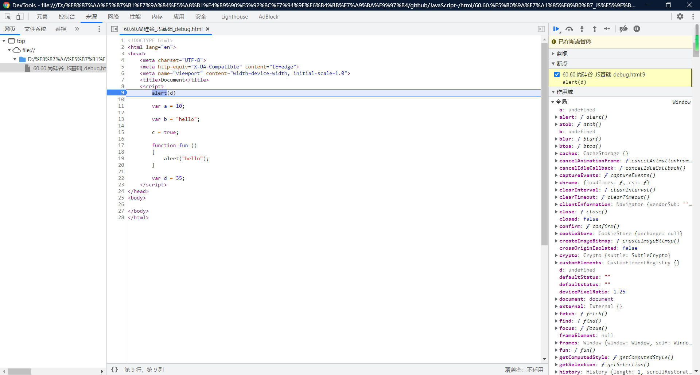

# debug：

```html
<!DOCTYPE html>
<html lang="en">
<head>
    <meta charset="UTF-8">
    <meta http-equiv="X-UA-Compatible" content="IE=edge">
    <meta name="viewport" content="width=device-width, initial-scale=1.0">
    <title>Document</title>
    <script>
        alert(d)

        var a = 10;

        var b = "hello";

        c = true;// it's not variable

        function fun ()
        {
            alert("hello");
        }

        var d = 35;
    </script>
</head>
<body>
    
</body>
</html>
```



谷歌debug方法：[链接](https://developer.chrome.com/docs/devtools/javascript/)