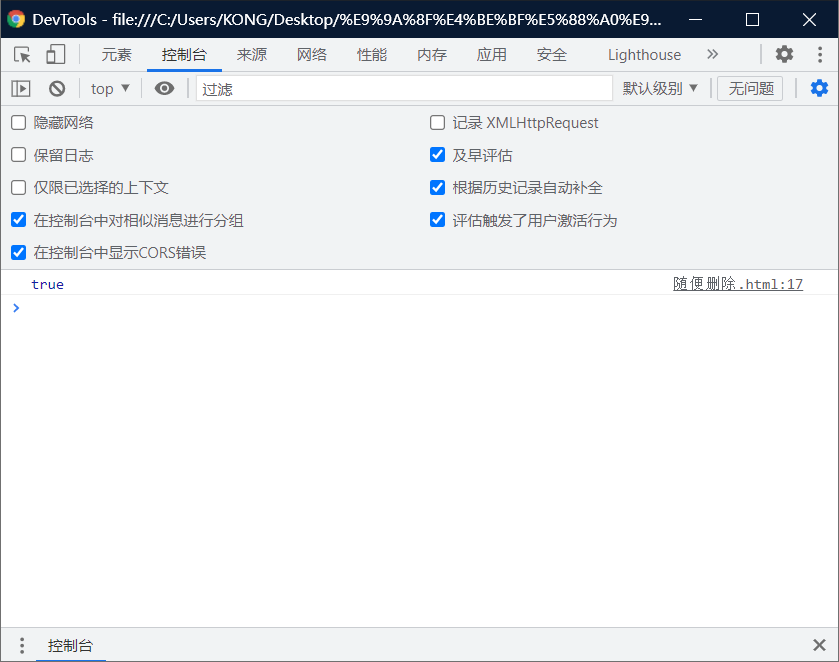
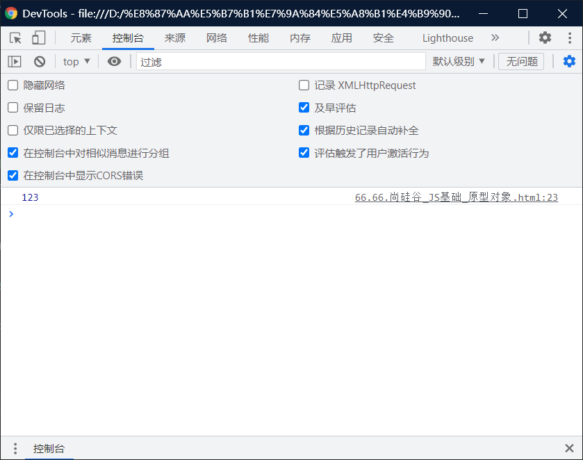
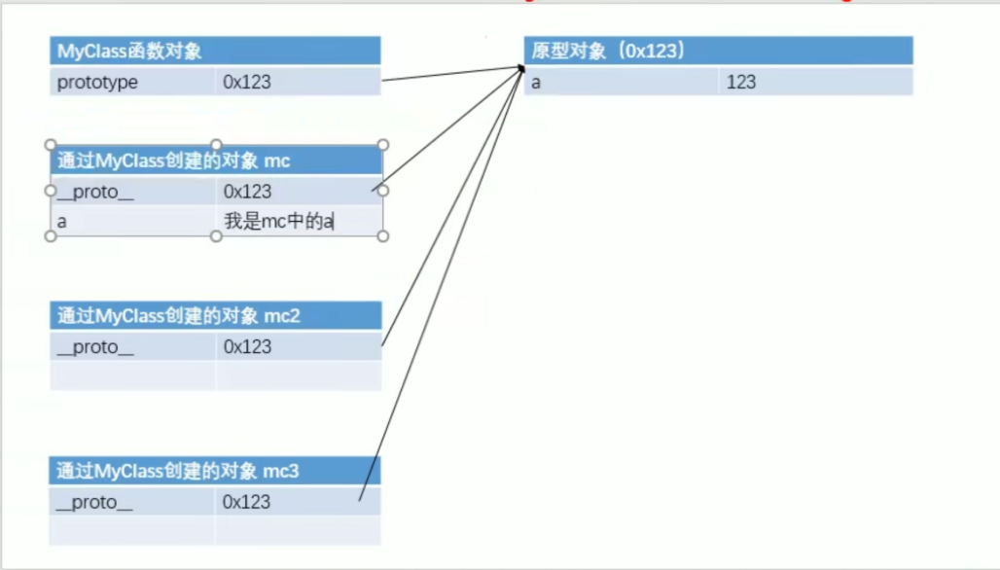

# 原型对象：

# 问题引入：

> - 将函数定义在全局作用域，污染了全局作用域的命名空间
>   - 而且定义在全局作用域中也很不安全

```html
 function fun ()
            {
                alert("hello everybody , i am :" + this.name)
            }
```

> - 这玩意可能因为其他人去写，而导致失效。

# 原型 prototype：

> - 我们所创建的每一个函数，解析器（浏览器）都会向函数中添加一个属性prototype。
>   - 这个属性对应这一个对象，这个对象就是我们所谓的原型对象。
> - 如果函数作为普通函数调用prototype没有任何作用
> - 当函数以构造函数的形式调用时，它所创建的对象中都会有一个隐含的属性。
>   - 指向该构造函数的原型对象，我们可以通过 `__proto__`来访问该属性。
>     - 注意：proto两边的下滑线都是有2个组成的。
>     - 同时注意是在英语格式下，按住shift来操作，出现的。
> - 核心代码：` console.log(mc.__proto__ == Myclass.prototype)`

```html
<!DOCTYPE html>
<html lang="en">
<head>
    <meta charset="UTF-8">
    <meta http-equiv="X-UA-Compatible" content="IE=edge">
    <meta name="viewport" content="width=device-width, initial-scale=1.0">
    <title>Document</title>
    <script>
        function Myclass()
        {

        }
        var mc = new Myclass();
        
        var mc2 = new Myclass();

        console.log(mc.__proto__ == Myclass.prototype)
    </script>
</head>
<body>
    
</body>
</html>
```

> 虽然不懂，但是随便。
>
> 

# 原型对象：

> - 原型对象就相当于一个公共的区域，所有同一个类的实例都可以访问到这个原型对象
>   - 我们可以将对象中共有的内容，统一设置到原型对象中。
> - 当我们访问对象的一个属性或方法时，它会先在对象自身中寻找，如果有则直接使用，
>   - 如果没有则会去原型对象中寻找，如果找到则直接使用。

```html
<!DOCTYPE html>
<html lang="en">
<head>
    <meta charset="UTF-8">
    <meta http-equiv="X-UA-Compatible" content="IE=edge">
    <meta name="viewport" content="width=device-width, initial-scale=1.0">
    <title>Document</title>
    <script>
        function Myclass()
        {

        }

        //向MyClass的原型中添加属性a
        Myclass.prototype.a = 123;


        var mc = new Myclass();
        
        var mc2 = new Myclass();

        // console.log(mc.__proto__ == Myclass.prototype)
        console.log(mc.a)
    </script>
</head>
<body>
    
</body>
</html>
```



## 向其中加入属性：

```html
<!DOCTYPE html>
<html lang="en">
<head>
    <meta charset="UTF-8">
    <meta http-equiv="X-UA-Compatible" content="IE=edge">
    <meta name="viewport" content="width=device-width, initial-scale=1.0">
    <title>Document</title>
    <script>
        function Myclass()
        {

        }

        //向MyClass的原型中添加属性a
        Myclass.prototype.a = 123;


        var mc = new Myclass();
        
        var mc2 = new Myclass();

        // console.log(mc.__proto__ == Myclass.prototype)

        //向MC中添加"a"属性//
        
        
        mc.a = "我是mc中的a"
        console.log(mc.a)
    </script>
</head>
<body>
    
</body>
</html>
```




# 原型对象的作用：

> - ==以后我们创建构造函数时候，可以将这些对象共有的属性和方法，统一添加到构造函数的原型对象中，这样不用分别为每一个对象添加，也不会影响到全局作用域，就可以使每个对象都具有这些属性和方法了。==