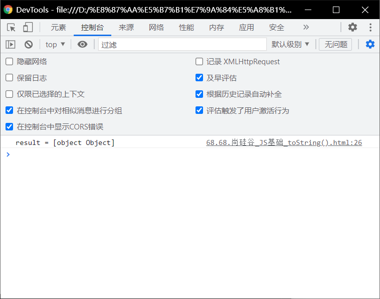

# toString()：用处不大

> - 当我们直接在页面中打印一个对象时，实际上是输出的对象的tostring( )方法的返回值。
> - 如果我们希望在输出对象时不输出[object object]，可以为对象添加一个tostring()方法
> - 

```html
<!DOCTYPE html>
<html lang="en">
<head>
    <meta charset="UTF-8">
    <meta http-equiv="X-UA-Compatible" content="IE=edge">
    <meta name="viewport" content="width=device-width, initial-scale=1.0">
    <title>Document</title>
    <script>
        function Person(name , age , gender)
        {
            this.name = name;
            this.age = age;
            this.gender = gender;
        }

        //创建一个Person实例
        var per = new Person("孙悟空",18,"男")

        //当我们直接在页面中打印一个对象时，实际上是输出的对象的tostring( )方法的返回值
        //如果我们希望在输出对象时不输出[object object]，可以为对象添加一个tostring()方法
        // per.toString = function()
        // {
        //     return "我是一个快乐的小person"
        // }
        var result = per.toString();
        console.log("result = " + result)
    </script>
</head>
<body>
    
</body>
</html>
```

