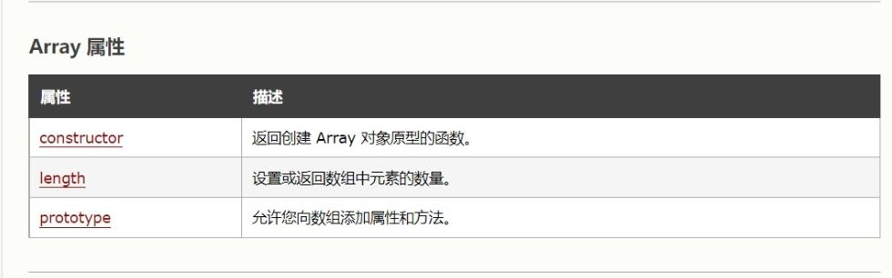
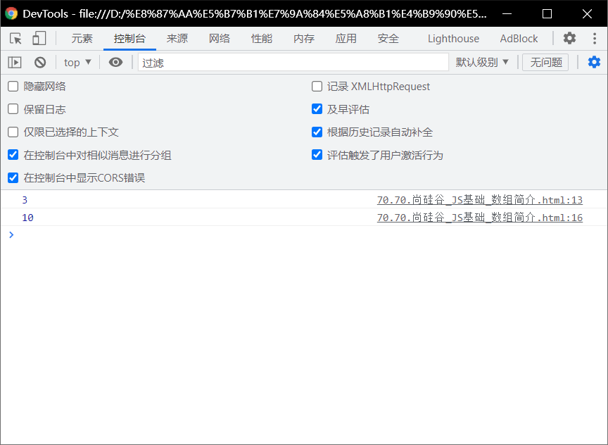
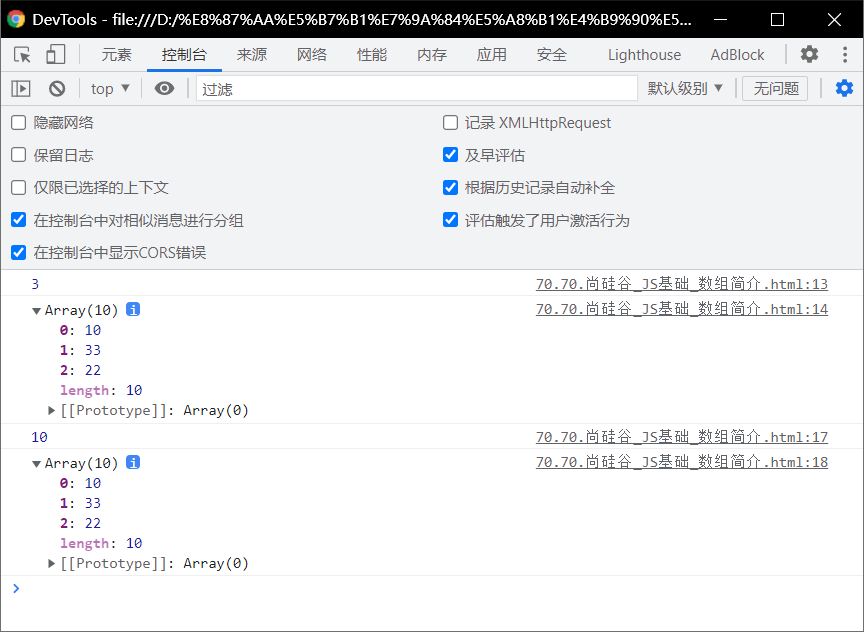
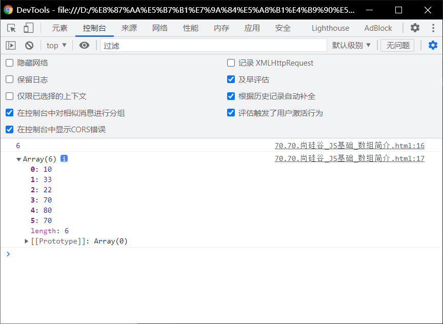

# 数组简介

> - 内建对象（常用）
> - 宿主对象（常用）
> - 自定义对象

# 数组定义：

> - 数组也是一个对象
> - 它和我们普通对象功能类似，也是用来存储一些值的。
> - 不同的是普通对象是使用字符串作为属性名的，
>   - 而数组时使用数字来作为索引操作元素。
> - 索引：
>   - 从0开始的整数就是==索引== 。
> - 数组的==存储性能==比普通对象要好,在开发中我们经常使用数组来存储一些数据。

# 对象和数组的区别：

.mp4_20220111_080506.232.jpg)

# 对数组的测试：

```html
<!DOCTYPE html>
<html lang="en">
<head>
    <meta charset="UTF-8">
    <meta http-equiv="X-UA-Compatible" content="IE=edge">
    <meta name="viewport" content="width=device-width, initial-scale=1.0">
    <title>Document</title>
    <script>
        var arr = new Array()


        //使用typeof检查一个数组时，会返回object
        console.log(typeof arr)


    </script>

</head>
<body>
    
</body>
</html>
```


# 创建一个数组：

> - 向数组中添加元素
> - 语法：
>   - `数组[索引] = 值`
> - 如果读取==不存在的索引==，==他不会报错而是返回undefined==

```html
<!DOCTYPE html>
<html lang="en">
<head>
    <meta charset="UTF-8">
    <meta http-equiv="X-UA-Compatible" content="IE=edge">
    <meta name="viewport" content="width=device-width, initial-scale=1.0">
    <title>Document</title>
    <script>
        var arr = new Array()
        arr[0] = 10;
        arr[1] = 33;
        arr[2] = 22;
        console.log(arr[0, 1,2])
    </script>

</head>
<body>
    
</body>
</html>
```

# 获取数组长度（即获取数组有几个数）：



[查询网址](https://www.w3school.com.cn/jsref/jsref_obj_array.asp)

> - length属性可以获取数组的长度
>
> - 语法：
>
>   - `数组.length`
>
> - 注意：
>
>   - 对于==连续==的数组，使用length可以获取到数组的长度(元素的个数)
>
>   - 对于==非连续==的数组，使用length会获取到数组的==最大的索引+1==
>
>     - 尽量不要创建非连续的数组。
>
>     - ```html
>       <!DOCTYPE html>
>       <html lang="en">
>       <head>
>           <meta charset="UTF-8">
>           <meta http-equiv="X-UA-Compatible" content="IE=edge">
>           <meta name="viewport" content="width=device-width, initial-scale=1.0">
>           <title>Document</title>
>           <script>
>               var arr = new Array()
>               arr[0] = 10;
>               arr[1] = 33;
>               arr[2] = 22;
>               arr[100] = 100
>              console.log(arr.length)
>           </script>
>       
>       </head>
>       <body>
>           
>       </body>
>       </html>
>       ```
>
>     - 

```html
<!DOCTYPE html>
<html lang="en">
<head>
    <meta charset="UTF-8">
    <meta http-equiv="X-UA-Compatible" content="IE=edge">
    <meta name="viewport" content="width=device-width, initial-scale=1.0">
    <title>Document</title>
    <script>
        var arr = new Array()
        arr[0] = 10;
        arr[1] = 33;
        arr[2] = 22;
       console.log(arr.length)

    </script>

</head>
<body>
    
</body>
</html>
```


# 修改length：

> -  如果修改的length==大于原长度==，则多出部分==会空出来==。
>
>   如果修改的length小于原长度，则多出的==元素被删除==。（可以对数组中的元素进行顺序删除，但是无法删除特定位置）

## 修改长度：

> - 语法：
>   - ` arr.length = num `

```html
<!DOCTYPE html>
<html lang="en">
<head>
    <meta charset="UTF-8">
    <meta http-equiv="X-UA-Compatible" content="IE=edge">
    <meta name="viewport" content="width=device-width, initial-scale=1.0">
    <title>Document</title>
    <script>
        var arr = new Array()
        arr[0] = 10;
        arr[1] = 33;
        arr[2] = 22;
       console.log(arr.length)
    //    console.log(arr)
        arr.length = 10
        console.log(arr.length)

    </script>

</head>
<body>
    
</body>
</html>
```



## 修改长度后对数组的影响：

```html
<!DOCTYPE html>
<html lang="en">
<head>
    <meta charset="UTF-8">
    <meta http-equiv="X-UA-Compatible" content="IE=edge">
    <meta name="viewport" content="width=device-width, initial-scale=1.0">
    <title>Document</title>
    <script>
        var arr = new Array()
        arr[0] = 10;
        arr[1] = 33;
        arr[2] = 22;
       console.log(arr.length)
       console.log(arr)
    //    console.log(arr)
        arr.length = 10
        console.log(arr.length)
        console.log(arr)

    </script>

</head>
<body>
    
</body>
</html>
```




> - 疑问：为什么第一个长度是3，但是array（）中的括号里面是10。

# 读取数组中的元素：

> - 语法：
>   - `数组[索引]`

# 向数组最后一个位置添加元素：

> - `arr[arr.length] = 70`
> - 语法：
>   - `数组[数组.length] = 值`

```html
<!DOCTYPE html>
<html lang="en">
<head>
    <meta charset="UTF-8">
    <meta http-equiv="X-UA-Compatible" content="IE=edge">
    <meta name="viewport" content="width=device-width, initial-scale=1.0">
    <title>Document</title>
    <script>
        var arr = new Array()
        arr[0] = 10;
        arr[1] = 33;
        arr[2] = 22;
        arr[arr.length] = 70;
        arr[arr.length] = 80;
        arr[arr.length] = 70;
        console.log(arr.length)
        console.log(arr)
    

    </script>

</head>
<body>
    
</body>
</html>
```

