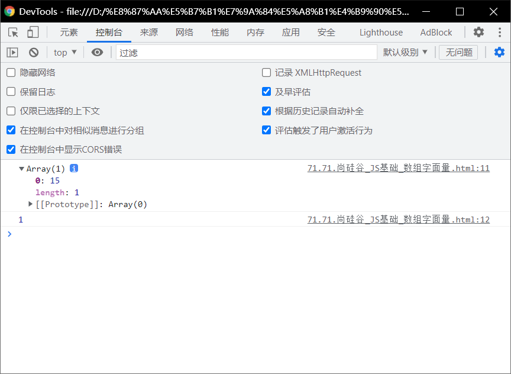
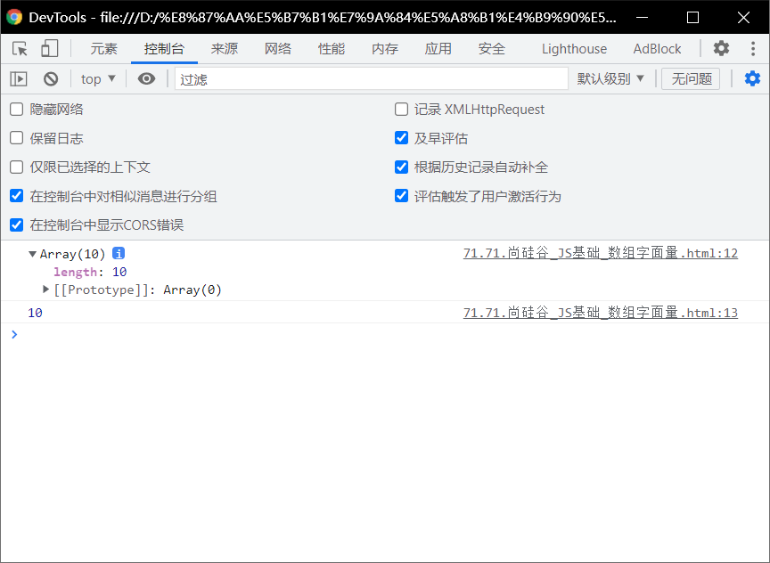
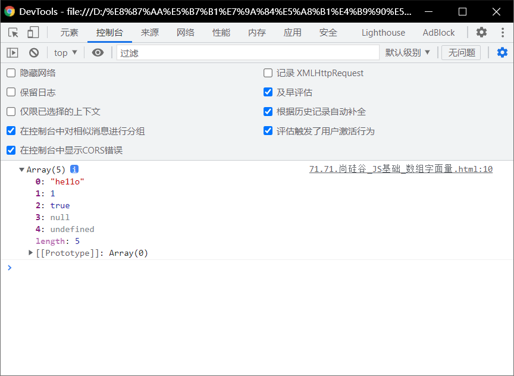
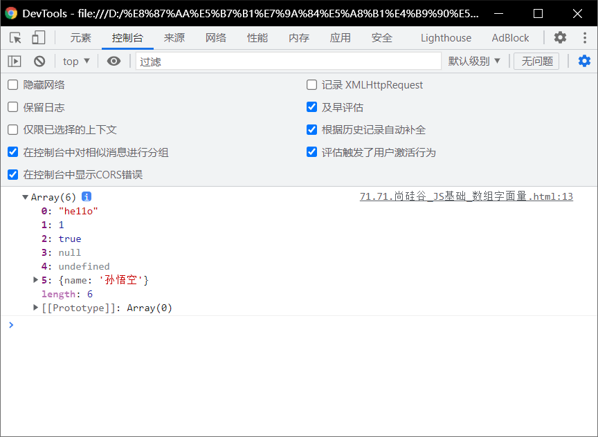
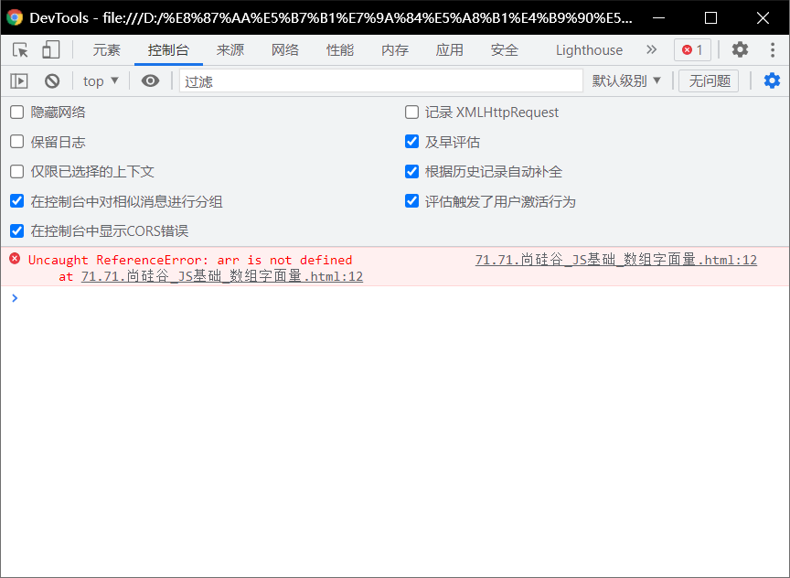
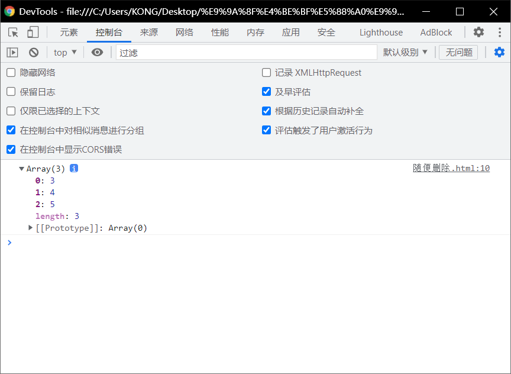
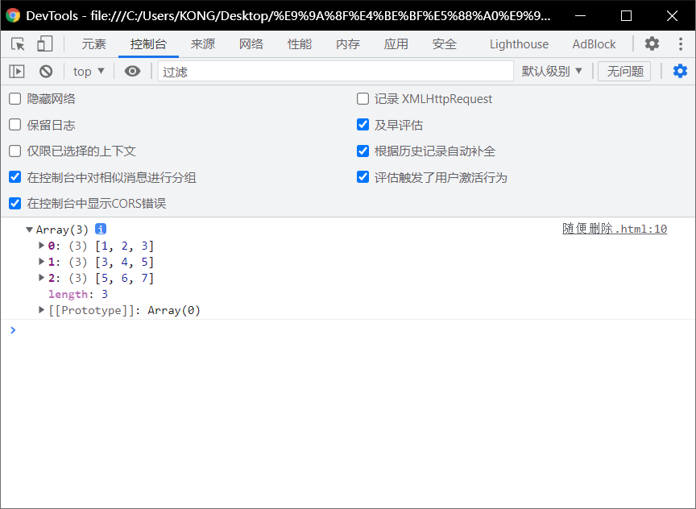

# 数组字面量：

# 使用字面量来创建数组：

> 一定要记住数组是从0开始的。

> - 语法：
>   - `var arr = [  ]`
> -  使用==字面量创建数组==时，可以在创建时就==指定数组中的元素==。
> - 使用==构造函数==创建数组时，也可以==同时添加元素==，==将要添加的元素==作为==构造函数的参数传递==。
> - //元素之间使用==逗号==隔开

```html
<!DOCTYPE html>
<html lang="en">
<head>
    <meta charset="UTF-8">
    <meta http-equiv="X-UA-Compatible" content="IE=edge">
    <meta name="viewport" content="width=device-width, initial-scale=1.0">
    <title>Document</title>
    <script>
        var arr = [1,2,3,4,5,6,10]
        console.log(arr)
        console.log(arr.length)
    </script>
</head>
<body>
    
</body>
</html>
```


# 创建数组区别：

## 创建一个数组，数组中只有一个元素是15.

> - ```html
>   <!DOCTYPE html>
>   <html lang="en">
>   <head>
>       <meta charset="UTF-8">
>       <meta http-equiv="X-UA-Compatible" content="IE=edge">
>       <meta name="viewport" content="width=device-width, initial-scale=1.0">
>       <title>Document</title>
>       <script>
>           // var arr = [1,2,3,4,5,6,10]
>           arr = [15]
>           console.log(arr)
>           console.log(arr.length)
>       </script>
>   </head>
>   <body>
>       
>   </body>
>   </html>
>   ```
>
> - 

## 创建一个长度为10的数组：


> - ```html
>   <!DOCTYPE html>
>   <html lang="en">
>   <head>
>       <meta charset="UTF-8">
>       <meta http-equiv="X-UA-Compatible" content="IE=edge">
>       <meta name="viewport" content="width=device-width, initial-scale=1.0">
>       <title>Document</title>
>       <script>
>           // var arr = [1,2,3,4,5,6,10]
>           // arr = [15]
>           arr = new Array(10)//usually we don't like do it , we like literal(字面量）.
>           console.log(arr)
>           console.log(arr.length)
>       </script>
>   </head>
>   <body>
>       
>   </body>
>   </html>
>   ```
>
> - 

# 数组中的元素可以是==*任意的数据类型*==:

> - ## string、num、Boolean、null、undefined（未定义）
>
> - null：有意缺少任何对象值

```html
<!DOCTYPE html>
<html lang="en">
<head>
    <meta charset="UTF-8">
    <meta http-equiv="X-UA-Compatible" content="IE=edge">
    <meta name="viewport" content="width=device-width, initial-scale=1.0">
    <title>Document</title>
    <script>
        arr = [ "he11o", 1,true, null,undefined];
        console.log(arr);
    </script>
</head>
<body>
    
</body>
</html>
```



> - ## 对象

```html
<!DOCTYPE html>
<html lang="en">
<head>
    <meta charset="UTF-8">
    <meta http-equiv="X-UA-Compatible" content="IE=edge">
    <meta name="viewport" content="width=device-width, initial-scale=1.0">
    <title>Document</title>
    <script>
        arr = [ "he11o", 1,true, null,undefined];//is important,if not it ,the program will undefined
        // console.log(arr);
        var obj = {name : "孙悟空"};
        arr[arr. length] = obj;
        console.log(arr);
    </script>
</head>
<body>
    
</body>
</html>
```



## 错误：

```html
<!DOCTYPE html>
<html lang="en">
<head>
    <meta charset="UTF-8">
    <meta http-equiv="X-UA-Compatible" content="IE=edge">
    <meta name="viewport" content="width=device-width, initial-scale=1.0">
    <title>Document</title>
    <script>
        // arr = [ "he11o", 1,true, null,undefined];
        // console.log(arr);
        var obj = {name : "孙悟空"};
        arr[arr. length] = obj;
        console.log(arr);
    </script>
</head>
<body>
    
</body>
</html>
```



## 改良版，可以不使用那个有问题的：

```html
<!DOCTYPE html>
<html lang="en">
<head>
    <meta charset="UTF-8">
    <meta http-equiv="X-UA-Compatible" content="IE=edge">
    <meta name="viewport" content="width=device-width, initial-scale=1.0">
    <title>Document</title>
    <script>
        arr = [{name:"孙悟空"},{name:"沙和尚"},{name :"猪八戒"}];
        console.log(arr[1].name);
        console.log(arr[2].name);
        console.log(arr[0].name);

    </script>
</head>
<body>
    
</body>
</html>
```


 

# 数组中也可以放数组，如下这种数组我们称为二维数组:

```html
<!DOCTYPE html>
<html lang="en">
<head>
  <meta charset="UTF-8">
  <meta http-equiv="X-UA-Compatible" content="IE=edge">
  <meta name="viewport" content="width=device-width, initial-scale=1.0">
  <title>Document</title>
  <script>
    arr=[[1,2,3],[3,4,5],[5,6,7]];
    console.log(arr[1]);

  </script>
</head>
<body>
  
</body>
</html>
```



```html
<!DOCTYPE html>
<html lang="en">
<head>
  <meta charset="UTF-8">
  <meta http-equiv="X-UA-Compatible" content="IE=edge">
  <meta name="viewport" content="width=device-width, initial-scale=1.0">
  <title>Document</title>
  <script>
    arr=[[1,2,3],[3,4,5],[5,6,7]];
    console.log(arr);

  </script>
</head>
<body>
  
</body>
</html>
```

