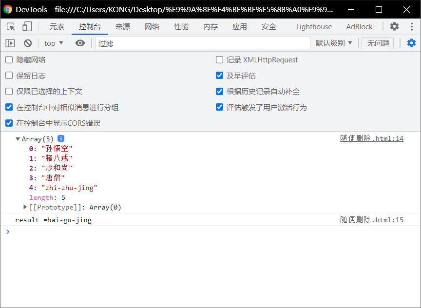
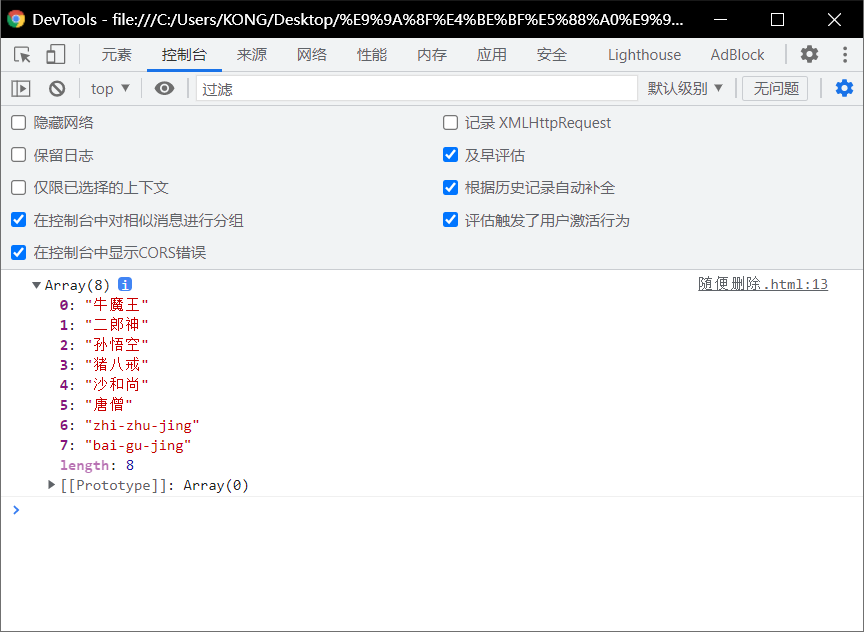
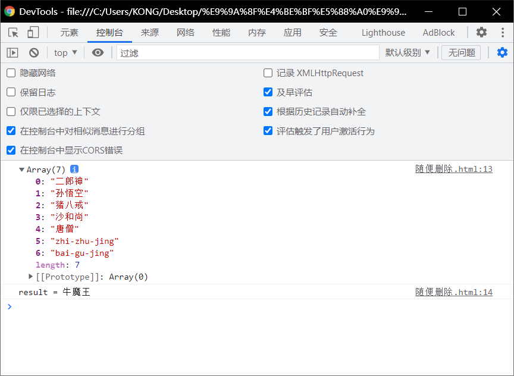
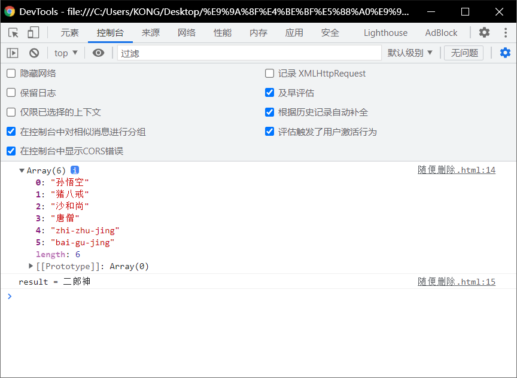

# 数组的四个方法：

#  push():

> - 该方法可以==向数组的*末尾添加*一个或多个元素，并返回数组的新的*长度*==
> - 可以将要添加的元素作为方法的参数传递.
>   - 这样这些元素将会自动添加到数组的末尾
> - 该方法会将数组新的长度作为返回值返回

```html
 <!DOCTYPE html>
 <html lang="en">
 <head>
   <meta charset="UTF-8">
   <meta http-equiv="X-UA-Compatible" content="IE=edge">
   <meta name="viewport" content="width=device-width, initial-scale=1.0">
   <title>Document</title>
   <script>
     var arr =["孙悟空","猪八戒","沙和尚"];
     var result = arr.push("唐僧","zhi-zhu-jing","bai-gu-jing")
     console.log(arr);
     console.log("result =" + result)
   </script>
 </head>
 <body>
   
 </body>
 </html>
```

# pop():

> - 该方法==可以*删除数组的最后一个元素*，并将被删除的元素作为返回值返回。==

```html
 <!DOCTYPE html>
 <html lang="en">
 <head>
   <meta charset="UTF-8">
   <meta http-equiv="X-UA-Compatible" content="IE=edge">
   <meta name="viewport" content="width=device-width, initial-scale=1.0">
   <title>Document</title>
   <script>
     var arr =["孙悟空","猪八戒","沙和尚"];
     var result = arr.push("唐僧","zhi-zhu-jing","bai-gu-jing")
    //  console.log(arr);
    //  console.log("result =" + result)
     result =arr.pop();
     console.log(arr);
     console. log( "result ="+result);
   </script>
 </head>
 <body>
   
 </body>
 </html>
```



#  unshift()

> - 向数组==开头添加一个或多个元素==，==并返回新的数组长度==

 ```html
  <!DOCTYPE html>
  <html lang="en">
  <head>
    <meta charset="UTF-8">
    <meta http-equiv="X-UA-Compatible" content="IE=edge">
    <meta name="viewport" content="width=device-width, initial-scale=1.0">
    <title>Document</title>
    <script>
      var arr =["孙悟空","猪八戒","沙和尚"];
      var result = arr.push("唐僧","zhi-zhu-jing","bai-gu-jing")
     // console.log(arr)
     arr.unshift("牛魔王","二郎神")
     console.log(arr)
    </script>
  </head>
  <body>
    
  </body>
  </html>
 ```



# shift()

> - 可以==册除数组的第一个元素==,并将被删除的元素作为返回值返回。

```html
 <!DOCTYPE html>
 <html lang="en">
 <head>
   <meta charset="UTF-8">
   <meta http-equiv="X-UA-Compatible" content="IE=edge">
   <meta name="viewport" content="width=device-width, initial-scale=1.0">
   <title>Document</title>
   <script>
     var arr =["孙悟空","猪八戒","沙和尚"];
     var result = arr.push("唐僧","zhi-zhu-jing","bai-gu-jing")
    arr.unshift("牛魔王","二郎神")
    result = arr.shift();
    console.log(arr)
    console.log("result = "+ result)
   </script>
 </head>
 <body>
   
 </body>
 </html>
```




## 删除两次：

```html
 <!DOCTYPE html>
 <html lang="en">
 <head>
   <meta charset="UTF-8">
   <meta http-equiv="X-UA-Compatible" content="IE=edge">
   <meta name="viewport" content="width=device-width, initial-scale=1.0">
   <title>Document</title>
   <script>
     var arr =["孙悟空","猪八戒","沙和尚"];
     var result = arr.push("唐僧","zhi-zhu-jing","bai-gu-jing")
    arr.unshift("牛魔王","二郎神")
    result = arr.shift();
    result = arr.shift();
    console.log(arr)
    console.log("result = "+ result)
   </script>
 </head>
 <body>
   
 </body>
 </html>
```

