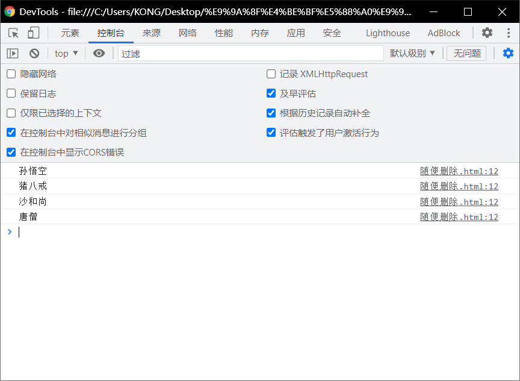
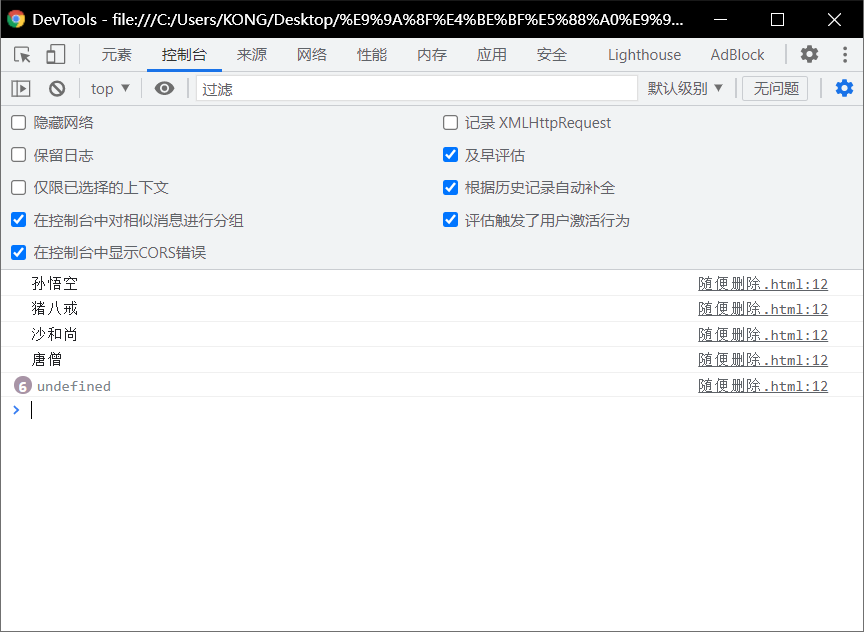

# 数组的遍历：

> - 所谓的遍历数组，就是将数组中所有的元素都取出
>   - 语法：
>     - ` for(var i = 0;i<arr.length;i++ )`
>     - 注意其中`i<arr.length`

```html
	 <!DOCTYPE html>
 <html lang="en">
 <head>
   <meta charset="UTF-8">
   <meta http-equiv="X-UA-Compatible" content="IE=edge">
   <meta name="viewport" content="width=device-width, initial-scale=1.0">
   <title>Document</title>
   <script>
      var arr =["孙悟空","猪八戒","沙和尚","唐僧"];
      for(var i = 0;i<arr.length;i++ )
      {
        console.log(arr[i])
      }
   </script>
 </head>
 <body>
   
 </body>
 </html>
```



## 注意：

> - for循环中的i是不能过大的
>   - 一旦大于数组中的值，就会返回undefined。

```html
 <!DOCTYPE html>
 <html lang="en">
 <head>
   <meta charset="UTF-8">
   <meta http-equiv="X-UA-Compatible" content="IE=edge">
   <meta name="viewport" content="width=device-width, initial-scale=1.0">
   <title>Document</title>
   <script>
      var arr =["孙悟空","猪八戒","沙和尚","唐僧"];
      for(var i = 0;i<10;i++ )
      {
        console.log(arr[i])
      }
   </script>
 </head>
 <body>
   
 </body>
 </html>
```

