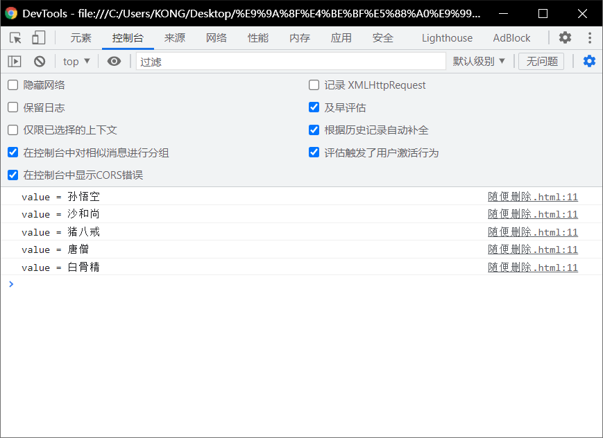
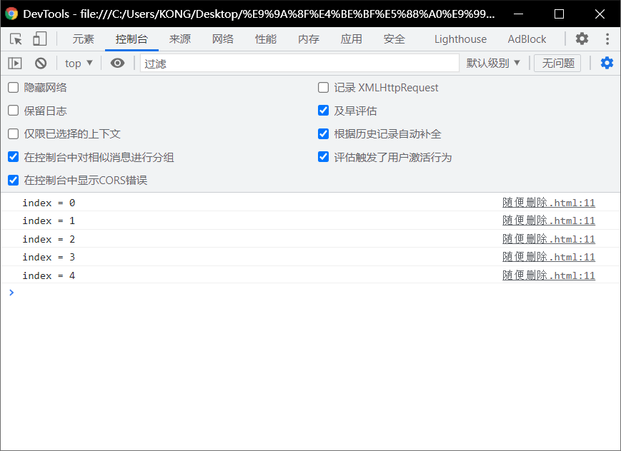
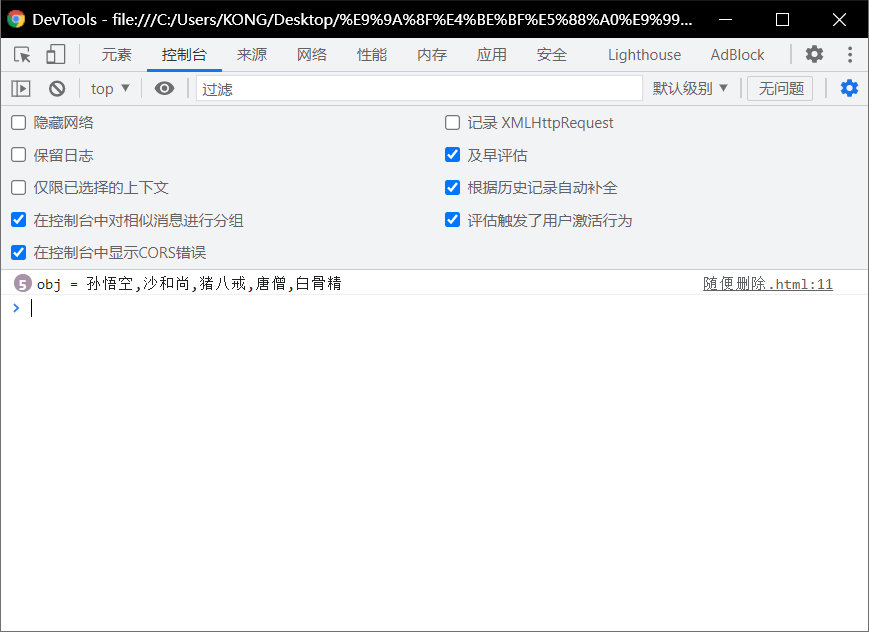

# forEach：

> - 一般我们都是使用for循环去遍历数组。
> - JS中还为我们提供了一个方法，用来
>   - 遍历数组forEach()
> - notice：
>   - 说方法只支持IE8以上的浏览器。
> - `forEach()`方法需要一个函数作为参数
>   - 像这种函数，由我们创建==但是不由我们调用==的,我们称为回调函数
>   - ==数组中有几个元素函数就会==执行几次==，每次执行时，浏览器会将遍历到的元素
>     - 以实参的形式传递进来，我们可以来定义形象，来读取这些内容。
>   - （重点）浏览器会在回调函数中传递三个参数
>     - 第一个参数,就是当前正在遍历的元素。
>     - 第二个参数，就是当前正在遍历的元素的索引
>     - 第三个参数，就是正在遍历的数组

## 第一个参数：（每个数组中的数被遍历）

```html
<!DOCTYPE html>
<html lang="en">
<head>
  <meta charset="UTF-8">
  <meta http-equiv="X-UA-Compatible" content="IE=edge">
  <meta name="viewport" content="width=device-width, initial-scale=1.0">
  <title>Document</title>
  <script>
    arr = ["孙悟空","沙和尚","猪八戒","唐僧","白骨精"];
    arr.forEach(function(value,index,obj){
      console.log("value = " + value)
    })

  </script>
</head>
<body>
  
</body>
</html>
```



## 第二个参数：（数组索引）

```html
<!DOCTYPE html>
<html lang="en">
<head>
  <meta charset="UTF-8">
  <meta http-equiv="X-UA-Compatible" content="IE=edge">
  <meta name="viewport" content="width=device-width, initial-scale=1.0">
  <title>Document</title>
  <script>
    arr = ["孙悟空","沙和尚","猪八戒","唐僧","白骨精"];
    arr.forEach(function(value,index,obj){
      console.log("index = " + index)
    })

  </script>
</head>
<body>
  
</body>
</html>
```



## 第三个参数：(正在遍历的数组)

```html
<!DOCTYPE html>
<html lang="en">
<head>
  <meta charset="UTF-8">
  <meta http-equiv="X-UA-Compatible" content="IE=edge">
  <meta name="viewport" content="width=device-width, initial-scale=1.0">
  <title>Document</title>
  <script>
    arr = ["孙悟空","沙和尚","猪八戒","唐僧","白骨精"];
    arr.forEach(function(value,index,obj){
      console.log("obj = " + obj)
    })

  </script>
</head>
<body>
  
</body>
</html>
```



# 注意：

> - forEach( )
>   - 这个方法只支持工E8以上的浏览器
>   - IE8及以下的浏览器均不支持该方法，所以如果需要兼容IE8，则不要使用forEach
>   - 还是使用for循环来
