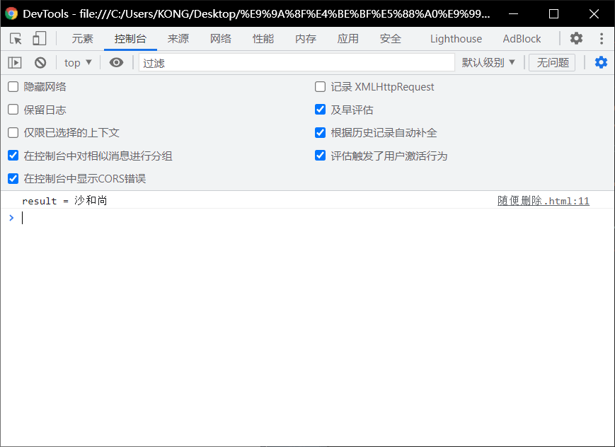
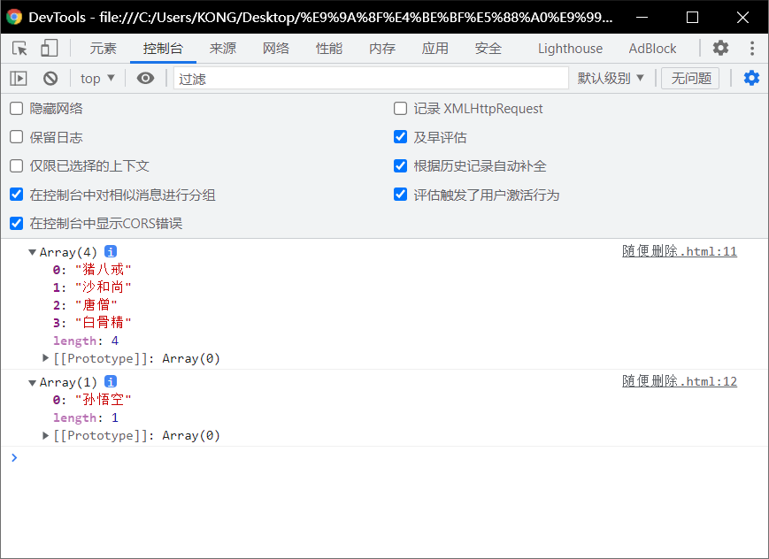
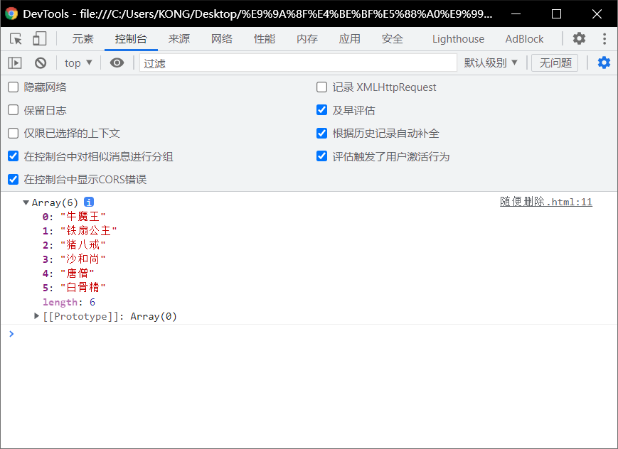

# slice和splice：

# slice()

> - 可以用来从数组提取指定元素
> - 该方法不会改变原数组，而是将截取到的元素封装倒到一个新数组中返回。
> - 参数：
>   - 截取开始的位置的索引，包含开始==索引==。
>   - 截取结束的位置的索引，不包含结束==索引==。
>     - 此方法可以代替`foreach()`中的第一个参数。
>       - 如：第二个参数可以省略不写,此时会截取从开始索引往后的所有元素。
>   - 

```html
<!DOCTYPE html>
<html lang="en">
<head>
  <meta charset="UTF-8">
  <meta http-equiv="X-UA-Compatible" content="IE=edge">
  <meta name="viewport" content="width=device-width, initial-scale=1.0">
  <title>Document</title>
  <script>
    arr = ["孙悟空","沙和尚","猪八戒","唐僧","白骨精"];
    var result = arr.slice(1,2)
    console.log('result = ' + result)

  </script>
</head>
<body>
  
</body>
</html>
```



# splice()

> - 和slice有一定区别，意思相反，但是使用的语法有问题。

> -  使用splice()会影响到原数组，会将指定元素从原数组中删除
>   - 并将被册除的元素作为返回值返回
> - 参数
>   - 第一个，表示开始==位置的索引==
>   - 第二个，表示==删除的数量==

```html
<!DOCTYPE html>
<html lang="en">
<head>
  <meta charset="UTF-8">
  <meta http-equiv="X-UA-Compatible" content="IE=edge">
  <meta name="viewport" content="width=device-width, initial-scale=1.0">
  <title>Document</title>
  <script>
   arr =["孙悟空","猪八戒","沙和尚","唐僧","白骨精"];
   var result = arr.splice(0,1);
    console.log(arr);
    console.log(result);

  </script>
</head>
<body>
  
</body>
</html>
```



## 也可以：

> - 第三个及以后：
>   - 可以传递一些新的元素,这些元素将会自动插入到==开始位置索引前边==。

```html
<!DOCTYPE html>
<html lang="en">
<head>
  <meta charset="UTF-8">
  <meta http-equiv="X-UA-Compatible" content="IE=edge">
  <meta name="viewport" content="width=device-width, initial-scale=1.0">
  <title>Document</title>
  <script>
   arr =["孙悟空","猪八戒","沙和尚","唐僧","白骨精"];
   var result = arr.splice(0,1,"牛魔王","铁扇公主");
    console.log(arr);
    // console.log(result);

  </script>
</head>
<body>
  
</body>
</html>
```

