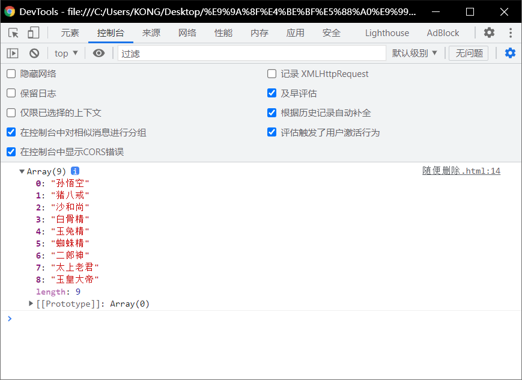
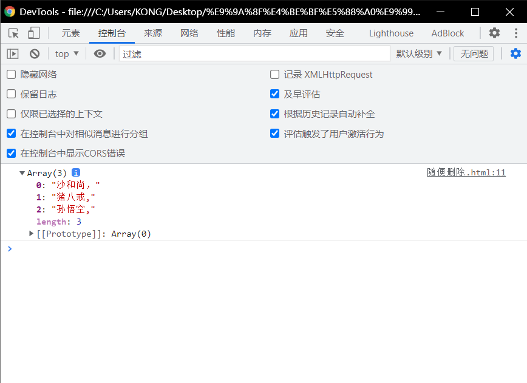
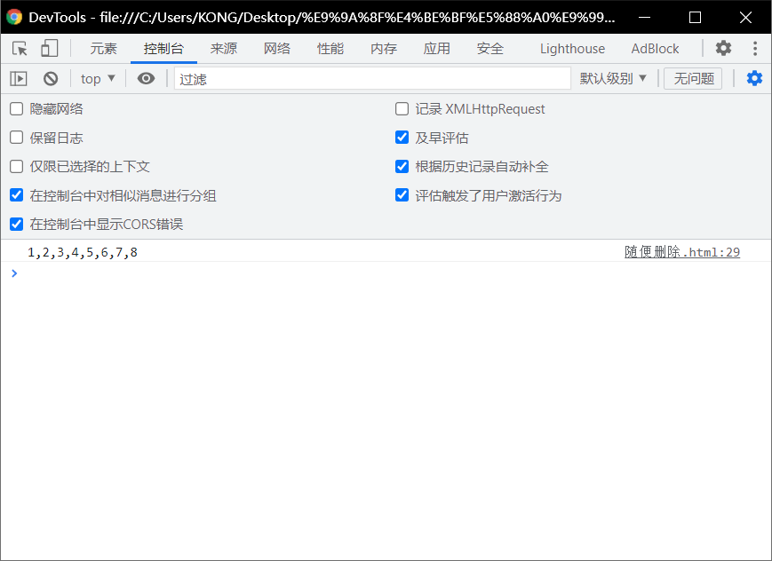

# 数组的剩余的一些方法：

#  concat()

> - `concat()`可以连接==两个或多个数组==，并将新的==数组返回==
>   - 该方法不会对原数组产生影响

## 串数组

```html
<!DOCTYPE html>
<html lang="en">
<head>
  <meta charset="UTF-8">
  <meta http-equiv="X-UA-Compatible" content="IE=edge">
  <meta name="viewport" content="width=device-width, initial-scale=1.0">
  <title>Document</title>
  <script>
    var arr =["孙悟空","猪八戒","沙和尚"];
    var arr2 =["白骨精","玉兔精","蜘蛛精"];
    var arr3 = ["二郎神","太上老君","玉皇大帝"];

    var result = arr.concat(arr2 ,arr3);
    console.log(result);

  </script>
</head>
<body>
  
</body>
</html>
```



## 串元素：

```html
<!DOCTYPE html>
<html lang="en">
<head>
  <meta charset="UTF-8">
  <meta http-equiv="X-UA-Compatible" content="IE=edge">
  <meta name="viewport" content="width=device-width, initial-scale=1.0">
  <title>Document</title>
  <script>
    var arr =["孙悟空","猪八戒","沙和尚"];
    var arr2 =["白骨精","玉兔精","蜘蛛精"];
    var arr3 = ["二郎神","太上老君","玉皇大帝"];

    var result = arr.concat(arr2 ,arr3,"牛魔王","铁扇公主");//其中的牛魔王和铁扇公主就是元素。
    console.log(result);

  </script>
</head>
<body>
  
</body>
</html>
```

# join()

> - 该方法可以将数组转换为==一个字符串==
> - 该方法不会对原数组产生影响，而是将转换后的字符串作为结果返回.
> - 在`join()`中可以指定==一个字符串作为参数==，这个==字符串将会成为数组中元素的连接符==

```html
<!DOCTYPE html>
<html lang="en">
<head>
  <meta charset="UTF-8">
  <meta http-equiv="X-UA-Compatible" content="IE=edge">
  <meta name="viewport" content="width=device-width, initial-scale=1.0">
  <title>Document</title>
  <script>
    var arr =["孙悟空,","猪八戒,","沙和尚，"];
    var result = arr.join("-");
    console.log(result);

  </script>
</head>
<body>
  
</body>
</html>
```


# reverse()

> - 该方法用来反转数组（前边的去后边，后边的去前边).
> - 该方法会直接修改原数组

```html
<!DOCTYPE html>
<html lang="en">
<head>
  <meta charset="UTF-8">
  <meta http-equiv="X-UA-Compatible" content="IE=edge">
  <meta name="viewport" content="width=device-width, initial-scale=1.0">
  <title>Document</title>
  <script>
    var arr =["孙悟空,","猪八戒,","沙和尚，"];
    arr.reverse();
    console.log(arr)

  </script>
</head>
<body>
  
</body>
</html>
```



# sort()

> -  可以用来对数组中的元素进行排序.
>   - 也会影响原数组，默认会按照Unicode编码进行排序。
> - 即使对于纯数字的数组，使用sort()排序时，也会按照Unicode编码来排序
>   - 所以对数字进排序时，可能会得到错误的结果。
> - 我们可以自己来指定排序的规则
>   - 我们可以在sort()添加一个回调函数，来制定排序规则。
>     - 回调函数中需要定义两个形参
>     - 浏览器将会分别使用数组中的元素作为实参去调用回调函数。
>     - 使用哪个元素调用不确定，但是肯定的是在数组中a一定在b前边。
>   - 浏览器会根据==回调函数的返回值==来决定元素的顺序。
>     - 如果返回一个大于0的值，则元素会交换位置  
>     - 如果返回一个小于0的值，则元素位置不变。
>     - 如果返回一个0，则认为两个元素相等,也不交换位置。

```html
<!DOCTYPE html>
<html lang="en">
<head>
  <meta charset="UTF-8">
  <meta http-equiv="X-UA-Compatible" content="IE=edge">
  <meta name="viewport" content="width=device-width, initial-scale=1.0">
  <title>Document</title>
  <script>
    arr = [5,4,2,1,3,6,8,7];
    arr.sort(function(a,b)
    {
      //前边的大
      if(a > b)
      {
        return 1
      }
      //比前面小
      else if(a < b)
      {
        return -1
      }
      else
      {
        return 0
      }
    })
    // arr.sort()
    var result = arr.join(arr.sort())
    console.log(arr.join())
  </script>
</head>
<html>
<body>
  
</body>
</html>
```

 

## 第二种方法：

> - 如果需要升序排列,则返回a-b
>   - 即`return a-b`
>   - 让其为正值
> - 如果需要降序排列，则返回b-a
>   - 即`return b-a`
>   - 让其为负值

```html

```

