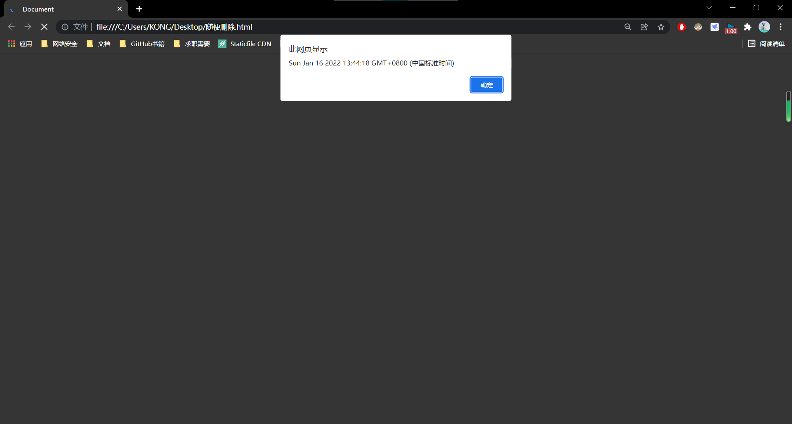
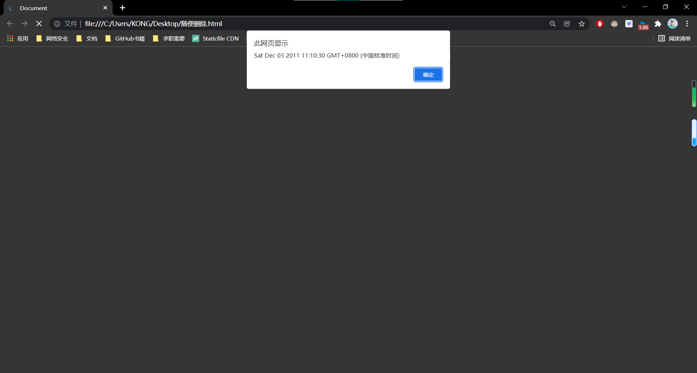
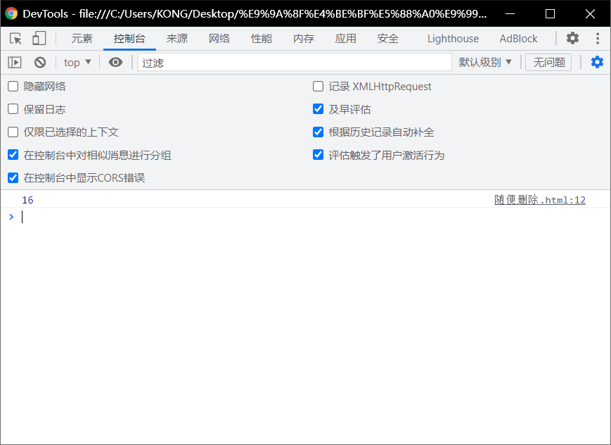
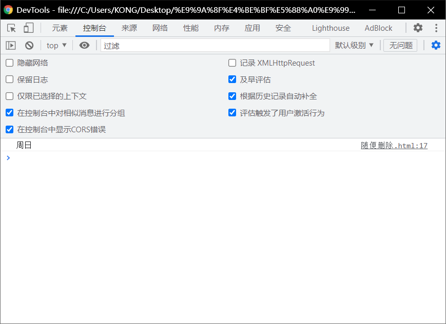
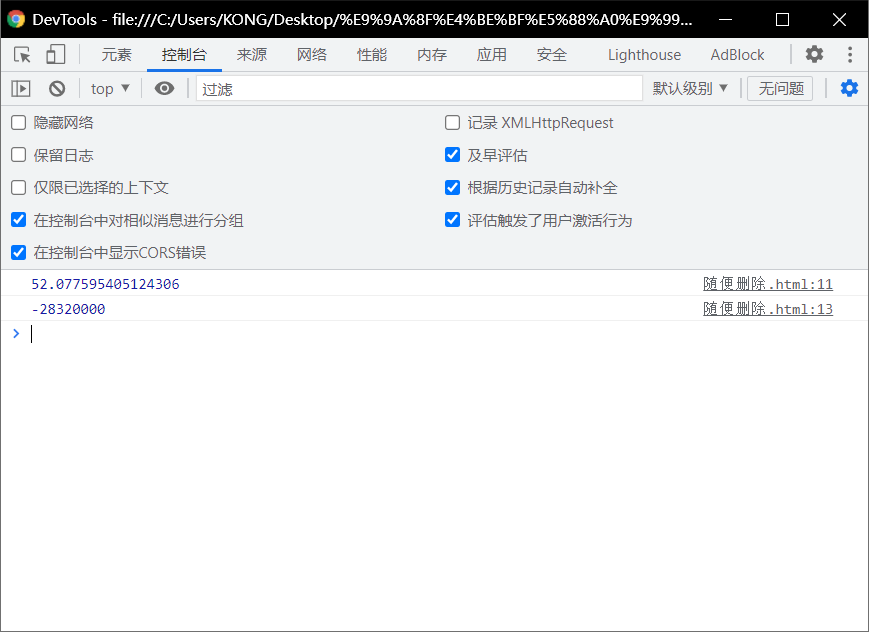
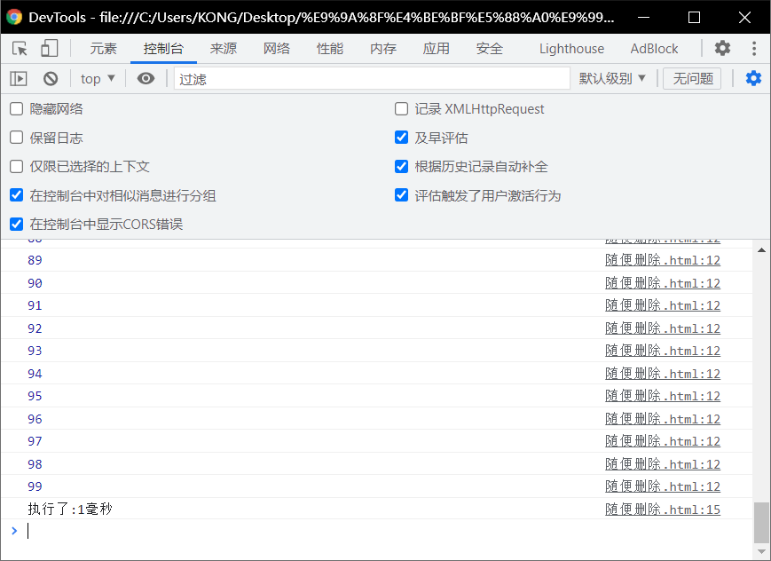

# Date对象：

> - 在JS中使用Date对象来表示一个时间.

> - 创建一个Date对象
> - 如果直接使用==构造函数创建一个Date对象==，则会==封装为当前代码执行的时间==.

```html
<!DOCTYPE html>
<html lang="en">
<head>
  <meta charset="UTF-8">
  <meta http-equiv="X-UA-Compatible" content="IE=edge">
  <meta name="viewport" content="width=device-width, initial-scale=1.0">
  <title>Document</title>
  <script>
    var d = new Date()
    alert(d)
  </script>
</head>
<body>
  
</body>
</html>
```



# 创建一个指定的时间对象：

> - 需要在构造函数中传递一个表示时间的字符串作为参数。
> - 日期的格式月份/日/年时:分:秒
>   - `var d2 = new Date( "12/03/2011 11:10:30");`

```html
<!DOCTYPE html>
<html lang="en">
<head>
  <meta charset="UTF-8">
  <meta http-equiv="X-UA-Compatible" content="IE=edge">
  <meta name="viewport" content="width=device-width, initial-scale=1.0">
  <title>Document</title>
  <script>
    var d = new Date( "12/03/2011 11:10:30")
    alert(d)
  </script>
</head>
<body>
  
</body>
</html>
```



# getDate()

> - 获取当前日期对象是几日
> - `var date = d.getDate();`

```html
<!DOCTYPE html>
<html lang="en">
<head>
  <meta charset="UTF-8">
  <meta http-equiv="X-UA-Compatible" content="IE=edge">
  <meta name="viewport" content="width=device-width, initial-scale=1.0">
  <title>Document</title>
  <script>
    var d = new Date( )
    console.log()
    var date = d.getDate();
 	 console.log(date)
  </script>
</head>
<body>
  
</body>
</html>
```



# getDay()

> - 获取当前日期对象为周几
> - 会返回一个0-6的值
>   - 0表示周日
>   - 1表示周一
>   - ··································

```html
<!DOCTYPE html>
<html lang="en">
<head>
  <meta charset="UTF-8">
  <meta http-equiv="X-UA-Compatible" content="IE=edge">
  <meta name="viewport" content="width=device-width, initial-scale=1.0">
  <title>Document</title>
  <script>
    var d = new Date( )
    console.log()
    var day = d.getDay()
    console.log(day)
    if(day == 0)
    {
      console.log("周日")
    }

  </script>
</head>
<body>
  
</body>
</html>
```



# getMonth()

> - `d2 =new Date("12/18/2011 11:10:30");`
> - 获取当前时间==对象的月份==
>   - 会返回一个0-11的值
>     - 0表示1月
>     - 1表示2月
>     - 11表示12月

```html
```


# 注意：

> - `var d = new Date()`中的d是必须写在下面的实参里面。
>   - ` var month = d.getMonth`

# getFullyear()

> - 获取当前时间对象的年份

# getTime()

> - 获取当前日期对象的时间戳
> - 时间戳，指的是从格林威治标准时间的1970年1月1日，0时0分0秒
>   - 到当前日期所花费的毫秒数（1秒= 1000毫秒)
> - 计算机底层在保存时间时使用都是时间戳

## 时间戳的作用：

```html
	<!DOCTYPE html>
<html lang="en">
<head>
  <meta charset="UTF-8">
  <meta http-equiv="X-UA-Compatible" content="IE=edge">
  <meta name="viewport" content="width=device-width, initial-scale=1.0">
  <title>Document</title>
  <script>
    var d2 = new Date()
    var time = d2.getTime();
    console.log(time/ 1000/60/60/24/365);
    var d3 =new Date( "1/1/1970 0:8:0");time = d3.getTime();
    console.log(time);
  </script>
</head>
<body>
  
</body>
</html>
```



## 获取当前的时间戳：

> - `time = Date.now();`

## 利用时间戳来测试代码的执行的性能:

```html
<!DOCTYPE html>
<html lang="en">
<head>
  <meta charset="UTF-8">
  <meta http-equiv="X-UA-Compatible" content="IE=edge">
  <meta name="viewport" content="width=device-width, initial-scale=1.0">
  <title>Document</title>
  <script>
    var start = Date.now();
  for(var i=0 ; i<100 ; i++)
  {
      console.log(i);
  }
    var end = Date. now();
    console. log("执行了:"+(end - start)+"毫秒");

  </script>
</head>
<body>
  
</body>
</html>
```

