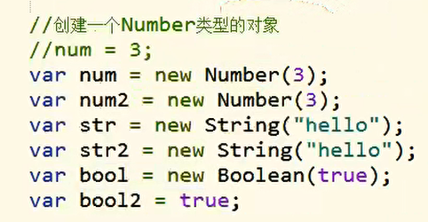

# 包装类：

# 引入：

> - 基本数据类型
>   - String Number Boolean Null Undefined
> - 引用数据类型
>   - Object

> - `String()`
>   - 可以将基本数据类型字符串转换为String对象
> - `Number()`
>   - 可以将基本数据类型的数字转换为Number对象
> - `Boolean()`
>   - 可以将基本数据类型的布尔值转换为Boolean对象

# 注意：

**以上方式千万不要写，谁写谁二逼。**

## JS布尔值(Boolean)转换规则

[网址](https://louiszhai.github.io/2015/12/11/js.boolean/)

# 基本数据类型的使用：

> - 方法和属性之能添加给对象,不能添加给基本数据类型
>   - 当我们对一些基本数据类型的值去调用属性和方法时，
>     - 浏览器会**临时**使用包**装类将其转换为对象**,然后在**调用对象的属性和方法.**
>     - *调用完以后,*在将其**转换**为**基本数据类型**

