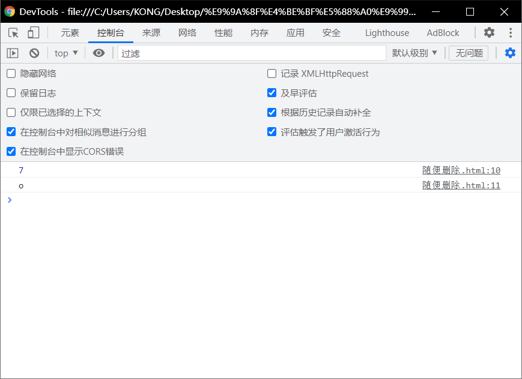
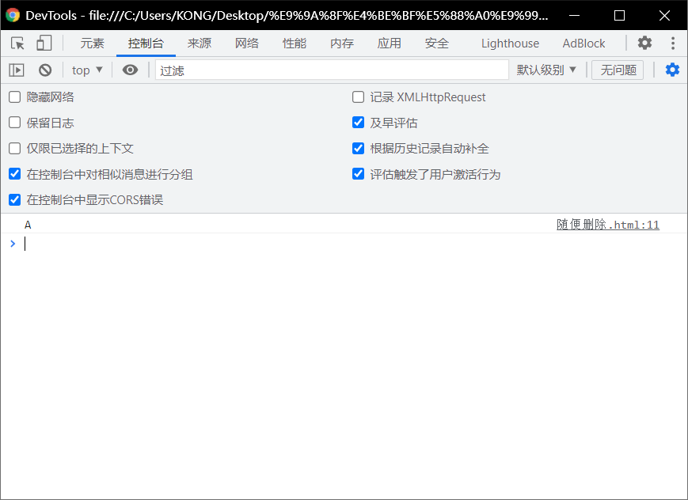
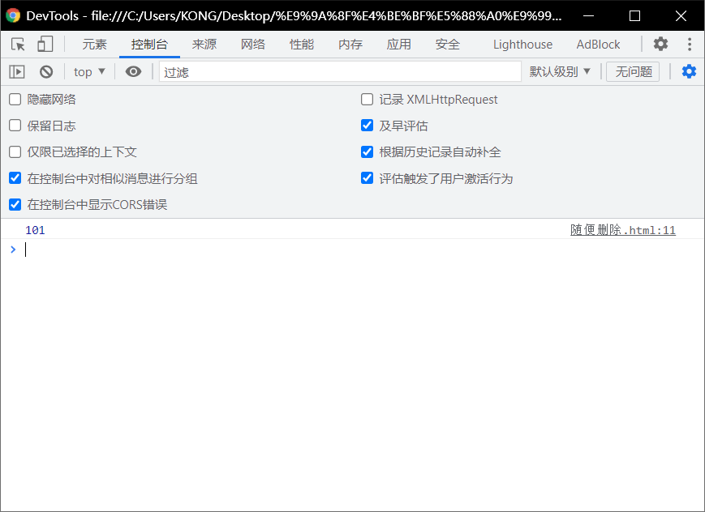
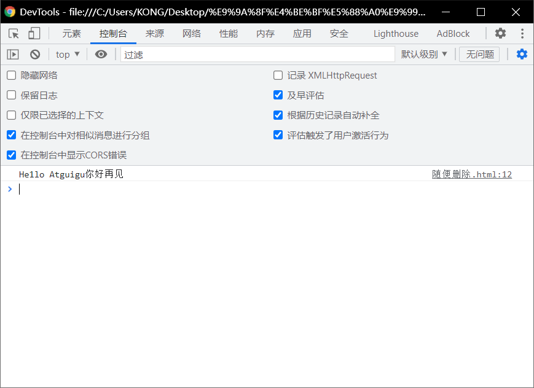
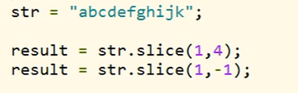
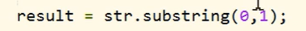
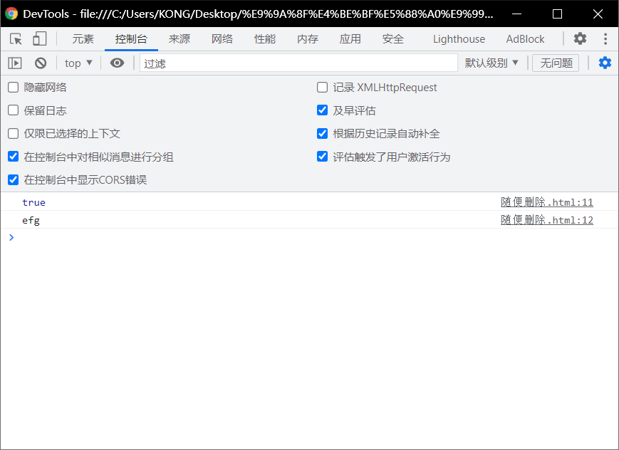

# string字符串的方法：

# length属性：

> - 可以用来获取字符串的长度.
> - ` console.log(str.length);l l console.log(str[5]);`

```html
	<!DOCTYPE html>
<html lang="en">
<head>
  <meta charset="UTF-8">
  <meta http-equiv="X-UA-Compatible" content="IE=edge">
  <meta name="viewport" content="width=device-width, initial-scale=1.0">
  <title>Document</title>
  <script>
    var str = "iamidot"
     console.log(str.length);//str的长度
     console.log(str[5]);//第五个是什么
  </script>
</head>
<body>
  
</body>
</html>
```



# `charAt()`

> - 可以返回字符串中指定位置的字符*-根据索引获取指定的字符

```html
<!DOCTYPE html>
<html lang="en">
<head>
  <meta charset="UTF-8">
  <meta http-equiv="X-UA-Compatible" content="IE=edge">
  <meta name="viewport" content="width=device-width, initial-scale=1.0">
  <title>Document</title>
  <script>
    str ="He1lo Atguigu" ;
    var result = str.charAt(6);
    console.log(result);
  </script>
</head>
<body>
  
</body>
</html>
```



# `charcodeAt()`

> - 获取**指定位置**字符的字符编码（Unicode编码)

```html
<!DOCTYPE html>
<html lang="en">
<head>
  <meta charset="UTF-8">
  <meta http-equiv="X-UA-Compatible" content="IE=edge">
  <meta name="viewport" content="width=device-width, initial-scale=1.0">
  <title>Document</title>
  <script>
    str ="He1lo Atguigu" ;
    result = str.charCodeAt(1);
    console.log( result);

  </script>
</head>
<body>
  
</body>
</html>
```



# `String.formCharCode()`

> - 可以根据**字符编码**去获取字符

```html
<!DOCTYPE html>
<html lang="en">
<head>
  <meta charset="UTF-8">
  <meta http-equiv="X-UA-Compatible" content="IE=edge">
  <meta name="viewport" content="width=device-width, initial-scale=1.0">
  <title>Document</title>
  <script>
    var result = String.fromCharCode(20035);
    console.log(result);

  </script>
</head>
<body>
  
</body>
</html>
```


# `concat()`

> - 可以用来连接两个或多个字符串
> - 作用和加号—样

```html
<!DOCTYPE html>
<html lang="en">
<head>
  <meta charset="UTF-8">
  <meta http-equiv="X-UA-Compatible" content="IE=edge">
  <meta name="viewport" content="width=device-width, initial-scale=1.0">
  <title>Document</title>
  <script>
    
    str ="He1lo Atguigu"
    var result = str.concat("你好","再见");
    console.log(result)

  </script>
</head>
<body>
  
</body>
</html>
```



# `indexOf()`

> - 该方法可以检索**一个字符串**中是否*含有* **指定内容**
> - 如果字符串中含有该内容，则会返回其第一次出现的索引
>   - 如果没有找到指定的内容，则返回-1.
> - 可以指定一个第二个参数，指定开始查找的位置
>   - ``

```html
<!DOCTYPE html>
<html lang="en">
<head>
  <meta charset="UTF-8">
  <meta http-equiv="X-UA-Compatible" content="IE=edge">
  <meta name="viewport" content="width=device-width, initial-scale=1.0">
  <title>Document</title>
  <script>
    str ="He1lo Atguigu"
    var result = str.indexOf("A")
    console.log(result);

  </script>
</head>
<body>
  
</body>
</html>
```


# `lastIndexof()`

> - 该方法的用法和`indexOf()`一样
>   - 不同的是`indexOf`是从**前**往后找
>   - 而`lastIndexOf`是从**后**往前找

```html
<!DOCTYPE html>
<html lang="en">
<head>
  <meta charset="UTF-8">
  <meta http-equiv="X-UA-Compatible" content="IE=edge">
  <meta name="viewport" content="width=device-width, initial-scale=1.0">
  <title>Document</title>
  <script>
    str ="He1lo Atguigu"
    var result = str.indexOf("A",1)//指定查找位置
    console.log(result);

  </script>
</head>
<body>
  
</body>
</html>
```


# `slice()`

> - 可以从字符串中截取指定的内容
> - 不会影响原字符串，而是将截取到内容返回
> - 参数
>   - 第一个，开始位置的索引(包括开始位置)
>   - 第二个，结束位置的索引(不包括结束位置)
>     - 如果省略第二个参数，则会截取到后边所有的
>   - 也可以传递一个负数作为参数，负数的话将会从后边计算



```html
<!DOCTYPE html>
<html lang="en">
<head>
  <meta charset="UTF-8">
  <meta http-equiv="X-UA-Compatible" content="IE=edge">
  <meta name="viewport" content="width=device-width, initial-scale=1.0">
  <title>Document</title>
  <script>
    str ="abcdefghijk";
    result = str.slice(1,4);
    result = str.slice(1,-1);
    console.log(result)

  </script>
</head>
<body>
  
</body>
</html>
```

# `substring()`

> - 可以用来截取一个字符串，可以`slice()`类似.
> - 参数：
>   - 第一个:开始截取位置的索引(包括开始位置)
>   - 第二个:结束位置的索引(不包括结束位置)

-------------------

> - 不同的是这个方法不能接受负值作为参数
>   - 如果传递了一个负值，则默认使用0
> - 而且他还自动调整参数的位置，如果第二个参数小于第一个，则自动交换



# `split()`

> - 可以将**一个字符串拆分为一个数组**
> - 参数:
>   - 需要**一个字符串作为参数**，将会根据**该字符串去拆分数组**

```html
<!DOCTYPE html>
<html lang="en">
<head>
  <meta charset="UTF-8">
  <meta http-equiv="X-UA-Compatible" content="IE=edge">
  <meta name="viewport" content="width=device-width, initial-scale=1.0">
  <title>Document</title>
  <script>
    str = "abc,bcd,efg,hij";
    result = str.split(",");
    console.log(Array.isArray ( result));
    console.log(result[2]);

  </script>
</head>
<body>
  
</body>
</html>
```



# `toUpperCase()`

> - 将一个字符串转换为大写并返回

```html
<!DOCTYPE html>
<html lang="en">
<head>
  <meta charset="UTF-8">
  <meta http-equiv="X-UA-Compatible" content="IE=edge">
  <meta name="viewport" content="width=device-width, initial-scale=1.0">
  <title>Document</title>
  <script>
    str = "abcbcdefghij";
    result = str.toUpperCase();
    console.log(result)
    // str ="ABCDEFG";

  </script>
</head>
<body>
  
</body>
</html>
```


# `toLowerCase()`

> - 将一个字符串转换为**小写**并返回