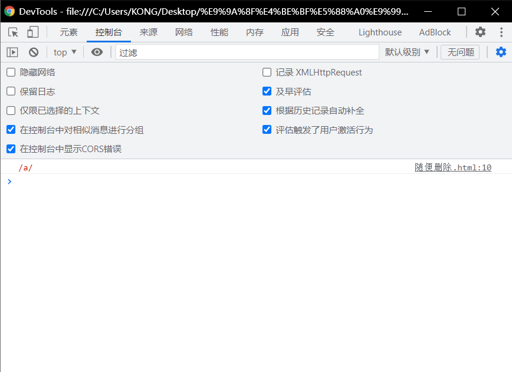
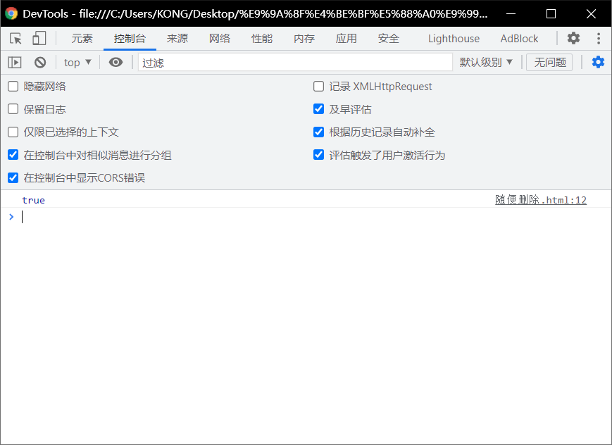

# 正则表达式的简介：

> - admin@atguigu.com
> - **错误的邮件格式**
>   - admin@.com
>   - adminatguigu.com
> - 邮件的规则:
>   - 前边可以是 XXXX 乱七八糟
>   - 跟着一个@
>   - 后边可以是 XXXX 乱七八糟
>   - .com获取其他的乱七八糟

# 正则表达式规则：

> - 正则表达式用于定义**一些字符串的规则**，
>   - 计算机可以根据正则表达式，来**检查一个字符串是否符合规则**，
>   - 获取**将字符串中符合规则的内容提取出来**

# 创建一个正则表达式：

> - 语法:
>   - `var变量= new RegExp("正则表达式","匹配模式");`
> - 使用`typeof()`检查正则对象，会返回object
> - `var reg = new RegExp("a");`这个正则表达式可以来**检查一个字符串中是否含有a**

--------

> - 在构造函数中可以**传递一个匹配模式作为第二个参数，**
>   - 可以是:
>     - i  忽略大小写
>     - g  全局匹配模式

```html
<!DOCTYPE html>
<html lang="en">
<head>
  <meta charset="UTF-8">
  <meta http-equiv="X-UA-Compatible" content="IE=edge">
  <meta name="viewport" content="width=device-width, initial-scale=1.0">
  <title>Document</title>
  <script>
    var reg = new RegExp("a")
    console.log(reg)
  </script>
</head>
<body>
  
</body>
</html>
```



# 正则表达式的方法：

# `test()`

> - 使用这个方法可以用来检查**一个字符串是否符合正则表达式的规则，**
> - 如果符合则返回true，否则返回false
------------
> - 在构造函数中可以**传递一个匹配模式作为第二个参数，**
>   - 可以是:
>     - i  忽略大小写
>     - g  全局匹配模式

```html
<!DOCTYPE html>
<html lang="en">
<head>
  <meta charset="UTF-8">
  <meta http-equiv="X-UA-Compatible" content="IE=edge">
  <meta name="viewport" content="width=device-width, initial-scale=1.0">
  <title>Document</title>
  <script>
    var reg = new RegExp("a")
    var str = "a"
    var result = reg.test(str)
    console.log(result)
  </script>
</head>
<body>
  
</body>
</html>
```



# 匹配大小写：

> - 在构造函数中可以**传递一个匹配模式作为第二个参数，**
>   - 可以是:
>     - i  忽略大小写
>     - g  全局匹配模式

```html
<!DOCTYPE html>
<html lang="en">
<head>
  <meta charset="UTF-8">
  <meta http-equiv="X-UA-Compatible" content="IE=edge">
  <meta name="viewport" content="width=device-width, initial-scale=1.0">
  <title>Document</title>
  <script>
    var reg = new RegExp("a","i")
    var str = "a"
    var result = reg.test(str)
    // console.log(result)
    console.log(reg.test("Abcbc"));
  </script>
</head>
<body>
  
</body>
</html>
```


