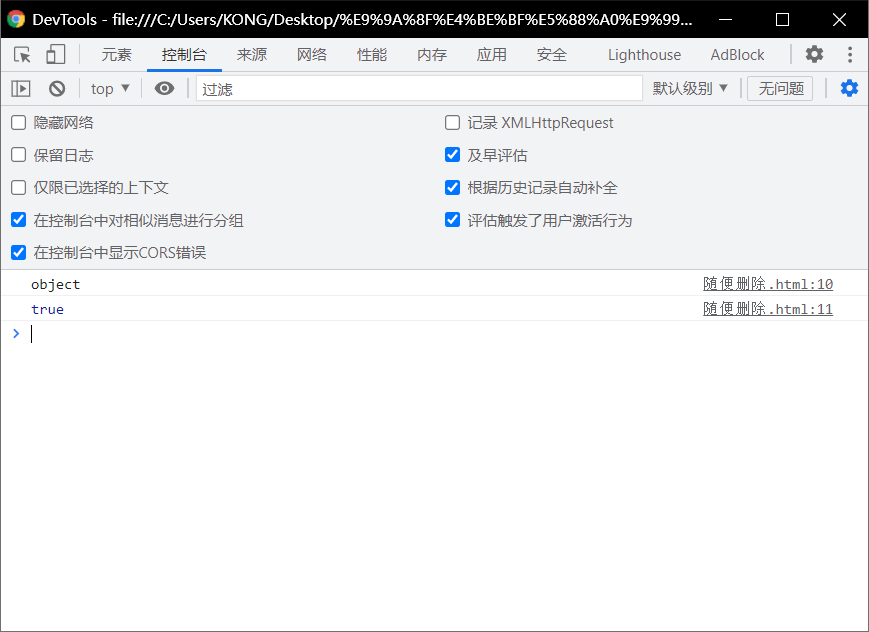
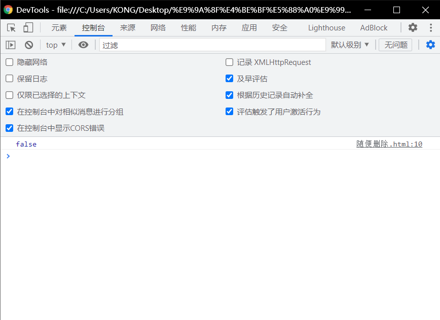

# 正则语法：

> - 使用字面量来创建正则表达式
> - 语法:
>   - ` var变量=/正则表达式/匹配模式`
> - 使用字面量的方式创建更加简单
>   - 使用构造函数创建更加灵活

```html
<!DOCTYPE html>
<html lang="en">
<head>
  <meta charset="UTF-8">
  <meta http-equiv="X-UA-Compatible" content="IE=edge">
  <meta name="viewport" content="width=device-width, initial-scale=1.0">
  <title>Document</title>
  <script>
    reg = /a/i;
    console.log(typeof reg);
    console.log(reg.test( "abc"));

    
  </script>
</head>
<body>
  
</body>
</html>
```



# 检查一个字符串中是否有a或b

> - 创建一个正则表达式，检查一个字符串中是否有a或b
>   - 使用    │   表示或者的意思 。
>   - `reg = /a| b/;`

```html
<!DOCTYPE html>
<html lang="en">
<head>
  <meta charset="UTF-8">
  <meta http-equiv="X-UA-Compatible" content="IE=edge">
  <meta name="viewport" content="width=device-width, initial-scale=1.0">
  <title>Document</title>
  <script>
    reg = /a | b/;
    console.log(reg.test( "bcd"));
    
  </script>
</head>
<body>
  
</body>
</html>
```



# 检查一个字符串中有字母:

> - 创建一个正则表达式检查一个字符串中是否有字母(多个字母)

## 一种方法：

> - [ ]里的内容也是或的关系
> - `[ab] == a|b`
> - `[a-z]`任意**小写字母**
> - `[A-Z]`任意**大写字母**
> - `[A-z]`**任意字母**
> - `[0-9]`任意**数字**

------------

> - 注意：
>   - `reg = /[ A-Z ]/`
>   - 其中的 //  千万不能忘记

```html
<!DOCTYPE html>
<html lang="en">
<head>
  <meta charset="UTF-8">
  <meta http-equiv="X-UA-Compatible" content="IE=edge">
  <meta name="viewport" content="width=device-width, initial-scale=1.0">
  <title>Document</title>
  <script>
    var reg = /[a-z]/
    console.log(reg.test("b"));
    
  </script>
</head>
<body>
  
</body>
</html>
```

结果是：true

# 检查一个字符串中无此字母:

> - `[^]`除了
>   - 解释：
>   - 除了a，b还有没有其他的字母
> - 语法：
>   - `reg =/[^ab]/`

```html
<!DOCTYPE html>
<html lang="en">
<head>
  <meta charset="UTF-8">
  <meta http-equiv="X-UA-Compatible" content="IE=edge">
  <meta name="viewport" content="width=device-width, initial-scale=1.0">
  <title>Document</title>
  <script>
    var reg =/[^ab]/ ;
    console.log( reg.test ( "ab" ));
    
  </script>
</head>
<body>
  
</body>
</html>
```

