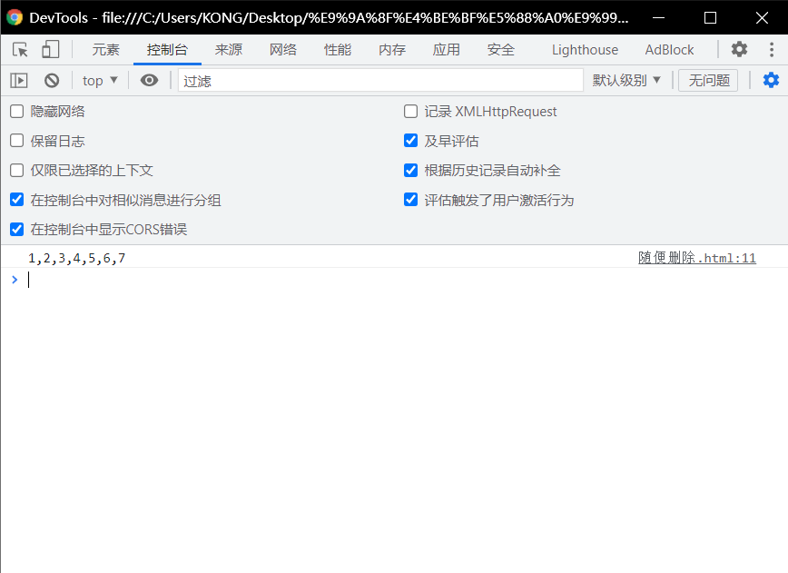
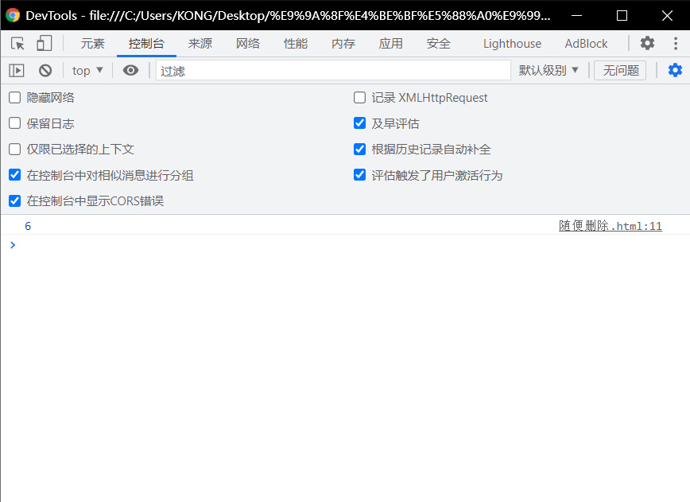
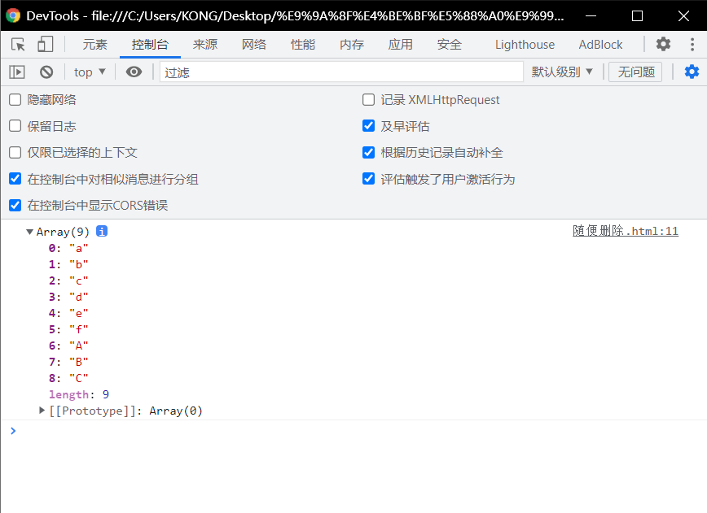
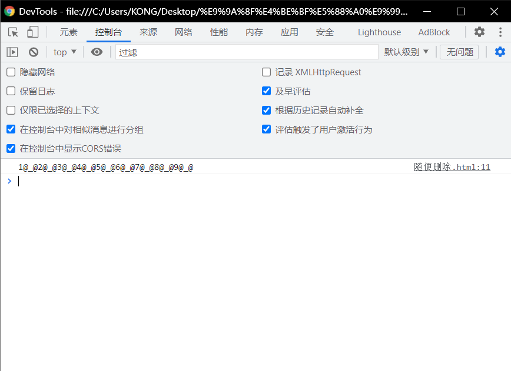

# 字符串和正则相关的方法：

# `split()`

> - 可以将**一个字符串拆分为一个数组**。
> - 方法中可以传递一个正则表达式作为参数，这样方法将会根据正则表达式去拆分字符串

## 根据任意字母来将字符串拆分：

```html
<!DOCTYPE html>
<html lang="en">
<head>
  <meta charset="UTF-8">
  <meta http-equiv="X-UA-Compatible" content="IE=edge">
  <meta name="viewport" content="width=device-width, initial-scale=1.0">
  <title>Document</title>
  <script>
    var str = "1a2b3c4d5e6f7";
    var result = str.split( /[A-z]/);
    console.log(result.join() );
  </script>
</head>
<body>
  
</body>
</html>
```



# `search()`

> - 可以**搜索字符串中是否含有指定内容**
> - 如果**搜索到指定内容**，则**会返回第一次出现的索引**，如果**没有搜索到返回   -1  。**
> - 它可以接受一个**正则表达式作为参数**，然后会根据正则表达式**去检索字符串**

## 搜索字符串中是否含有abc或aec或afc

> - 注意：
>   - 其中` result = str.search(/a[bef]c/);`
>   - 中的`(/a[bef]c/)`
>     - 解释：a和c是必须的，其中[bef]是可以随便选择的。
>     - 可组成：
>       - afc、abc、aec

```html
<!DOCTYPE html>
<html lang="en">
<head>
  <meta charset="UTF-8">
  <meta http-equiv="X-UA-Compatible" content="IE=edge">
  <meta name="viewport" content="width=device-width, initial-scale=1.0">
  <title>Document</title>
  <script>
    str = "hello abc hello aec afc";
    result = str.search(/a[bef]c/);
    console.log(result);
  </script>
</head>
<body>
  
</body>
</html>
```



# `match()`

> - 可以根据正则表达式，**从一个字符串中将符合条件的内容提取出来。**
> - **默认情况**下我们的match**只会找到第一个符合要求的内容**，**找到以后就停止检索**
>   - 我们可以设置**正则表达式为全局匹配模式,**这样就会匹配到所有的内容
>   - 可以为**一个正则表达式设置多个匹配模式**，且**顺序无所谓。**
> - `match()`会将匹配到的内容**封装到一个数组中返回**，即使只查询到一个结果

```html
<!DOCTYPE html>
<html lang="en">
<head>
  <meta charset="UTF-8">
  <meta http-equiv="X-UA-Compatible" content="IE=edge">
  <meta name="viewport" content="width=device-width, initial-scale=1.0">
  <title>Document</title>
  <script>
    str = "1a2b3c4d5e6f7A8B9C";
    result = str.match(/[a-z]/ig);//既有全局还有忽略，也可以写成gi
    console.log(result);//如果你用谷歌浏览器，你会发现它返回的是一个数组。array
  </script>
</head>
<body>
  
</body>
</html>
```



# `replace()`

> - 可以**将字符串中指定内容替换为新的内容**。
> - 参数
>   - 被替换的内容
>   - 新的内容
> - 默认只会替换第一个

```html
<!DOCTYPE html>
<html lang="en">
<head>
  <meta charset="UTF-8">
  <meta http-equiv="X-UA-Compatible" content="IE=edge">
  <meta name="viewport" content="width=device-width, initial-scale=1.0">
  <title>Document</title>
  <script>
    str = "1a2b3c4d5e6f7A8B9C";
    result = str.replace(/[a-z]/gi , "@_@");
    console.log(result);
  </script>
</head>
<body>
  
</body>
</html>
```


