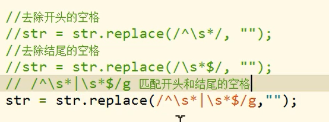

# 正则表达式语法(2)

# 检查一个字符串中是否含有"."

> - ". "表示任意字符
> - 在正则表达式中使用\作为**转义字符**
> - "\．"来表示
>   - 代码
>   - `var reg = / \. /`

----------------

# 不同字母和转义符号组合之后的区别：

> - \ w
>   - 任意字母、数字、_ 
>     - [A-z0-9]
> - \ W
>   - 除了字母、数字、_
>     - `[^A-z0-9_]`
> - \d
>   - 任意的数字`[0-9]`
> - \D
>   - 除了数字`[^0-9]`
> - \s
>   - 空格
> - \S
>   - 除了空格
> - \b
>   - 单词边界
> - \B
>   - 除了单词边界

# 去除掉字符串中的前后的空格

> - **去除空格就是使用""来替换空格**

