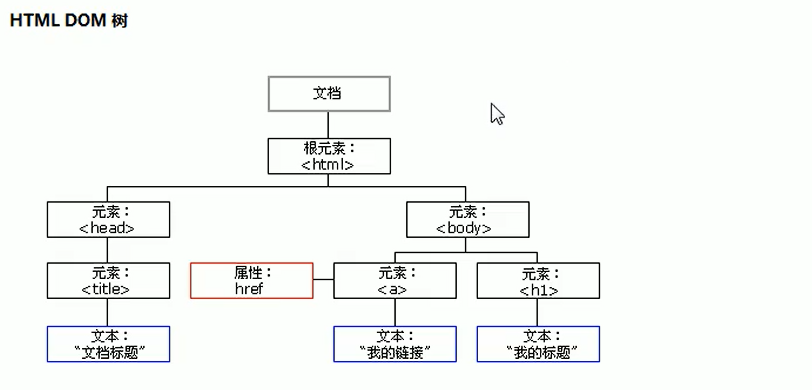
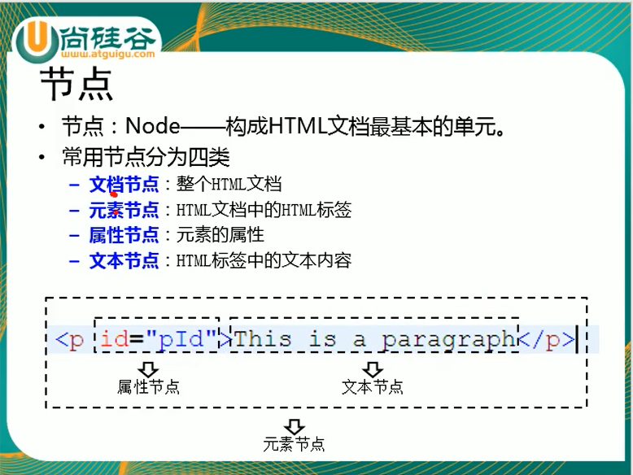
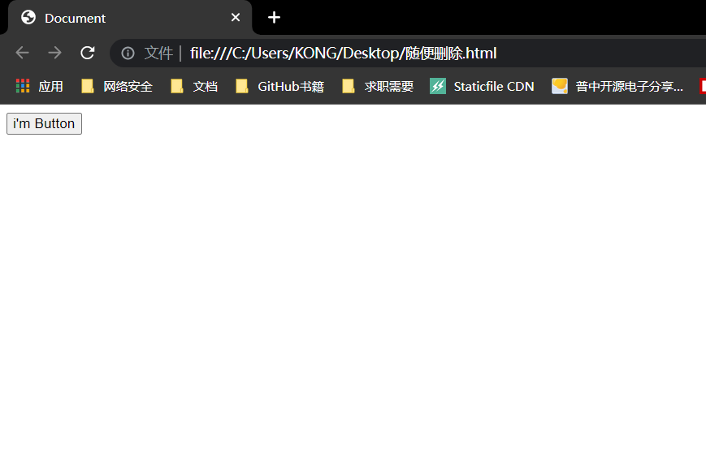

# DOM简介:





# 例子：

> - 浏览器已经为我们提供**文档节点对象这个对象是window属性**
> - 可以在页面中**直接使用**，**文档节点**代表的是**整个网页**

# 获取到button对象：

> - `document.getElementById("btn");`

```html
<!DOCTYPE html>
<html lang="en">
<head>
  <meta charset="UTF-8">
  <meta http-equiv="X-UA-Compatible" content="IE=edge">
  <meta name="viewport" content="width=device-width, initial-scale=1.0">
  <title>Document</title>
</head>
<body>
  <button id="btn">我是一个按钮</button>
  <script>
    var btn = document.getElementById("btn");
    console.log(btn)

  </script>
</body>
</html>
```

# 修改按钮的文字：

> - `btn.innerHTML ="i'm Button" ;`

```html
<!DOCTYPE html>
<html lang="en">
<head>
  <meta charset="UTF-8">
  <meta http-equiv="X-UA-Compatible" content="IE=edge">
  <meta name="viewport" content="width=device-width, initial-scale=1.0">
  <title>Document</title>
</head>
<body>
  <button id="btn">我是一个按钮</button>
  <script>
   btn.innerHTML ="i'm Button"


  </script>
</body>
</html>
```

