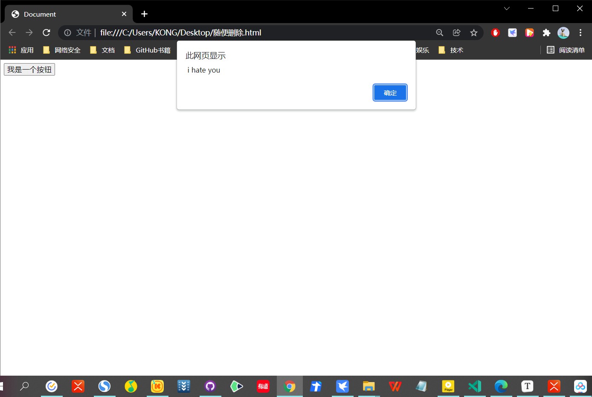

# 事件的简介：

# 什么是事件：

> - 事件，就是**用户和浏览器之间的交互行为**，
>   - 比如:点击按钮，鼠标移动、关闭窗口···························

# 应用：

> - 我们可以**在事件对应的属性中设置一些`js`代码，**
>   - 这样**当事件被触发时**，这些**代码将会执行**

```html
<!DOCTYPE html>
<html lang="en">
<head>
  <meta charset="UTF-8">
  <meta http-equiv="X-UA-Compatible" content="IE=edge">
  <meta name="viewport" content="width=device-width, initial-scale=1.0">
  <title>Document</title>
</head>
<body>
  <button id="btn" onmousemove="alert(' i hate you') ";>我是一个按钮</button>
  <!-- 当鼠标移到按钮的上，就是弹出i hate you -->
</body>
</html>
```



# 绑定一个单击事件：

> - 可以为按钮的对应事件绑定处理函数的形式来响应事件
> - 这样当事件被触发时，其对应的函数将会被调用。
> - 像这种为单击事件绑定的函数，我们称为单击响应函数

```html
<!DOCTYPE html>
<html lang="en">
<head>
  <meta charset="UTF-8">
  <meta http-equiv="X-UA-Compatible" content="IE=edge">
  <meta name="viewport" content="width=device-width, initial-scale=1.0">
  <title>Document</title>
</head>
<body>
  <script>
      //获取按钮对象
	var btn = document.getElementById ( "btn");

    btn.onclick = function()
    {
      alert("你还点~~~")
    }
  </script>
</body>
</html>
```

