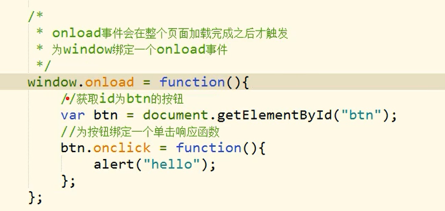

# 文档的加载：

> - 浏览器在加载一个页面时，是按照**自上向下的顺序加载**的。
> - **读取到一行就运行一行**,如果将**script标签写到页面的上边，**
> - **在代码执行时，页面还没有加载**,页面**没有加载DOM对象也没有加载**
>   - 会导致**无法获取到DOM对象**

--------

> - 将`js`代码编写到页面的下部就是为了，可以在页面加载完毕以后再执行`js`代码
> - 就是说，`JS`代码只能写在body里面不要写在head里面。

# 写在head里面的方法：

# `onload()`

> - onload事件会在整个页面加载完成之后才触发
> - 为**window绑定一个onload事件**
>   - 该**事件对应的响应函数**将会在**页面加载完成之后执行，**
>   - *这样可以确保我们的代码执行时所有的DOM对象已经加载完毕了*

