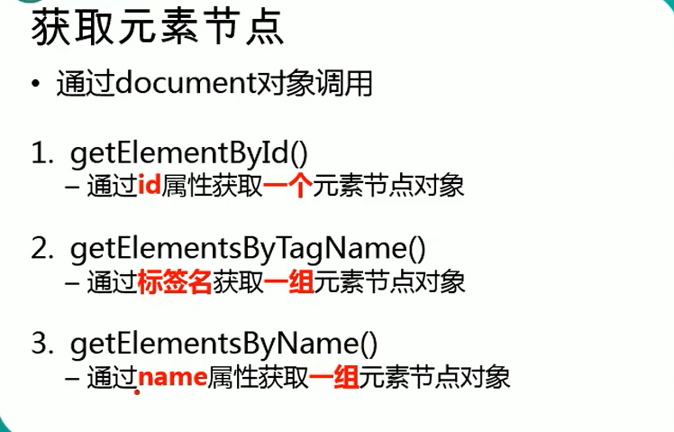

# dom查询：



# 例子：

> - 引入新函数
>
>   - inner
>   - 可以把得到html对象，里面的东西提取出来。
>   - 即，如果没有inner，得到的是这一行代码，有了之后，得到的是这一行代码里面东西。
>
> - 查找#bj节点
>
>   - ```html
>     <!DOCTYPE html>
>     <html lang="en">
>     <head>
>       <meta charset="UTF-8">
>       <meta http-equiv="X-UA-Compatible" content="IE=edge">
>       <meta name="viewport" content="width=device-width, initial-scale=1.0">
>       <title>Document</title>
>       <script>
>         window.onload = function()
>         {
>           //查找#bj节点
>           //为id为btn01的按钮绑定一个单击响应函数
>           var btn01 = document.getElementById( "btne1");
>           btn01.onclick = function()
>           {
>             //查找#bj节点
>     
>             var bj = document.getElementById ("bj");
>     
>             //打印bj
>             //innerHTML通过这个属性可以获取到元素内部的html代码.
>     
>             alert(bj.innerHTML);
>     
>           }
>         }
>       </script>
>     </head>
>     <body>
>       
>     </body>
>     </html>
>     ```
>
>   - 

