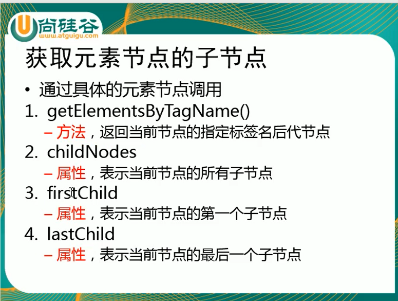

# DOM查询(1):

# 获取元素节点的子节点:



```html
<!DOCTYPE html>
<html>
<head>
<meta charset="utf-8">
<title>菜鸟教程(runoob.com)</title>
</head>
<body>

<p>你好世界!</p>
<div id="main">
<p> DOM 是非常有用的。</p>
<p>该实例展示了  <b>getElementsByTagName</b> 方法</p>
</div>
<script>
var x=document.getElementById("main");
var y=x.getElementsByTagName("p");//这个是在id为main里面找
document.write('id="main"元素中的第一个段落为：' + y[0].innerHTML);
</script>

</body>
</html>
```

